[[Deterministic Finite State Automata|DFA]]  and [[Non Deterministic Finite State Atomata|NFA]] 
Are the non Deterministic versions of [[Deterministic Finite State Automata|Automata]].

We also stated [[Theorem 2]] 2 which states that [[Deterministic Finite State Automata|DFA]]$\equiv$ [[Non Deterministic Finite State Atomata|NFA]].

We have not proofed it but now follows the proof!
# Proof [[Theorem 2]] 
First we proof [[Deterministic Finite State Automata|DFA]] $\leftarrow$ [[Non Deterministic Finite State Atomata|NFA]] by showing that [[Non Deterministic Finite State Atomata|NFA]]s are just a special case of [[Deterministic Finite State Automata|DFA]]s.
let $\mathcal{A}=\{Q,A,\Delta,q_0,F\}$ be a [[Non Deterministic Finite State Atomata|NFA]] thats accepts the Language $L$. The corresponding [[DFA]]  would be the following:
$\mathcal{A}=\{Q',A,\delta',q_0',F'\}$
We have a equivalent alphabet $A$, but different set of states $Q'$, a different [[Transition function]] $\delta'$, a different initial state $q_0$ and a different set of end states $F$.

Where $Q'=2^Q$ which is the [[Power set]] of $Q$. This means that $Q'$ consists of all  subsets of $Q$ and $Q$ itself.
$q_0'=\{q_0\}$ is a [[Singleton]] only consisting of the initial state of $Q$

Now comes the definition of the transition relation $\delta'$:
For all  $p \in Q'$ where p is a set of states of $Q$ (see definition of $Q'$) and  all symbols $a \in A$:
$\delta'(\underbrace{p}_{Q'},a)=\Delta(\underbrace{p}_{Q},a)$
==What does this mean?==
The state that the [[Deterministic Finite State Automata|DFA]] can reach from state $p \in Q'$ by reading $a$ is equal to the set of states that the [[Non Deterministic Finite State Atomata|NFA]] can reach in state $p \in Q$  when reading in $a$. 
Probably like this: (own interpretation)
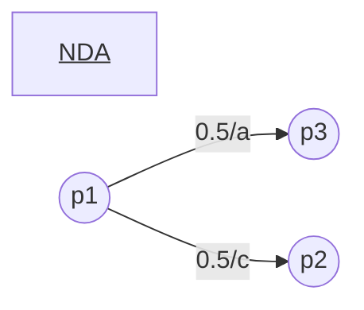
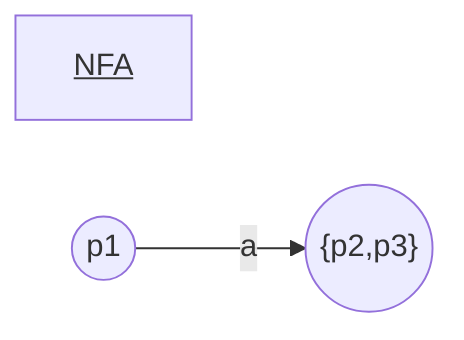

Now we have to define the set of finite states of our [[Deterministic Finite State Automata|DFA]] $F'$
Let's remember that the acceptance condition for  a [[Non Deterministic Finite State Atomata|NFA]] is existential so only one of the possible states to reach needs to be an end state.
$F'=\{\underbrace{p}_{\text{states of } \mathcal{A'}} \in Q': \underbrace{p}_{\text{set of states of} \mathcal{A}} \cap F \neq \emptyset\}$
$F'$ contains all sets of $Q'$ that contain a  final state of $Q$!

What remains of the proof? ==exercise==
- We proof by induction on the length of the word $w$ that $\delta'(q_0',w)=\Delta(q_0,w)$

> The base case is $|w|=0$ 
>For the inductive step we need to proof that the assumption holds for all words with $|w|\leq n$ and proof it for the word $|wa|$ with the length n+1

- We need to also proof that when the computations of the [[Non Deterministic Finite State Atomata|NFA]] are successful also the computation of the [[Deterministic Finite State Automata|DFA]] is successful.

==Ask Sasha if he knows the proof of this==

Now we can define using [[Theorem 2]] that [[Regular Languages]] are those languages $L\subset A^*$ that are recognized by the [[Non Deterministic Finite State Atomata|NFA]].

This has the advantage that we can switch between the two classes.

For example when we have a [[Deterministic Finite State Automata|Automaton]] which accepts the language $L$ and we want to find a [[Deterministic Finite State Automata|Automaton]] that accepts the complemetary language. 

> [!note] what is the [[Complement of a Language]]?
> If we have a language $L \subseteq A^*$ then the [[Complement of a Language]] $\overline{L}$ consists of all all the words of the that are not part of $L$ i.e. $\overline{L}=A^*-L$

This is important because it heavily used in model checking.

It is easy to find the [[Complement of a Language]]  by exploiting [[Determinism]] of [[Deterministic Finite State Automata|DFA]].

==Important:== [[Non Deterministic Finite State Atomata|NFA]] and [[Deterministic Finite State Automata|DFA]] are not always [[logical equivalence|logically equivalent]] but when they are it makes our life easier.


# [[Non Deterministic Finite State Atomata|NFA]] with $\epsilon$-moves
It is very similar to the normal [[Non Deterministic Finite State Atomata|NFA]] but has $\epsilon$-moves
> [!note] Definition: [[NFA with epsilon-move]]
> We have an [[Deterministic Finite State Automata|Automaton]] $(Q,A,\Delta,q_0,F)$ where $Q,A,q_0$ and $F$ have definitions equla to the normal [[Non Deterministic Finite State Atomata|NFA]]. 
> The only difference is $\Delta$
> $\Delta: Q \times (A \cup\{\epsilon\}) \rightarrow 2^Q$
> 
> This means that independent of the state one is in it is always possible to read the empty word $\epsilon$ as input. This is simmilar to a idle move.
> 
> How do we define $\hat{\Delta}$ the transition function accepting words?
> 
> $\hat{\Delta}(q,\epsilon)=\epsilon\text{-closure}(q)$
> 


Now lets consider:
$q \in Q$ and $p \in 2^Q$
An $\epsilon$-move is a transition of the form $\Delta(q,\epsilon)$. 
What is an [[epsilon-closure]]:
> [!note] [[epsilon-closure]]
> Is the set of states that you can reach within a [[NFA with epsilon-move]] from a state $q$ by repeatedly applying only the empty word $\epsilon$.
> This set of states is denoted as $\epsilon$-closure(q)

==important:== [[Non Deterministic Finite State Atomata|NFA]]s are not a special case of [[NFA with epsilon-move]] without the epsilon move. It $\epsilon$-moves do not increase [[expressiveness]].

We can not only define the [[epsilon-closure]] for single states but also for a set of states:
for all $q \in 2^Q$ we can define the [[epsilon-closure]] of the set ($\underline{q}$)=$\bigcup\limits_{q\in \underline{q}} \epsilon\text{-closure}(q)$ 
How do we generalize it to entire words $w$ preceeded by a symbol $a$?
$\hat{\Delta}(q,wa)=\epsilon-\text{closure}(\bigcup\limits_{p \in \hat{\Delta}(q,w)}\Delta (p,a)$

What does this mean? It is the $\epsilon$-closure of all states that one can reach by first applying first the individual symbols of the word $w$ followed by a symbol $a$. After every symbol applied a $\epsilon$-closure needs to be applied. Example:

w=xy
a=z
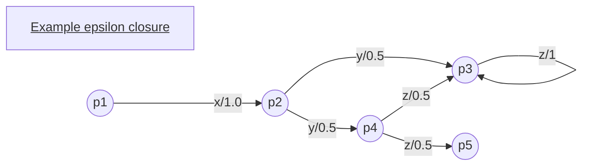
How does our $\epsilon$-closure($\Delta,wa$) look like?
1. when we apply x the first symbol of the word $w$ we add to our expression:
$\epsilon\text{-closure}(p_2)$
2. when we read in y we have two states that we can possibly reach ($p_3,p_4$)so we add them both
$\epsilon\text{-closure}(p_2)\cup\epsilon\text{-closure}(p_3)\cup\epsilon\text{-closure}(p_4)$
3. Now that we process $a=z$ we have two states that we can be in, first: $p_3$ which adds itself and from state,  and second:$p_4$ we can reach $p_3$ and $p_5$.
$\epsilon\text{-closure}(p_2)\cup\epsilon\text{-closure}(p_3)\cup\epsilon\text{-closure}(p_4)\cup \epsilon\text{-closure}(p3)\cup\epsilon\text{-closure}(p_5)\cup\epsilon\text{-closure}(p3)$
4. Now summarizing we delete the double-mentions and denote from which symbol each $\epsilon$-closure comes from 
$\underbrace{\epsilon\text{-closure}(p_2)}_{x}\cup \underbrace{\epsilon\text{-closure}(p_3)}_{y \& z \& z}\cup \underbrace{\epsilon\text{-closure}(p_4)}_{y}\cup\underbrace{\epsilon\text{-closure}(p_5)}_{z}$

# [[Theorem 3]]
> [!note] [[Theorem 3]]
> For all [[NFA with epsilon-move]] $\mathcal{A}$ there exists a [NFA](Non%20Deterministic%20Finite%20State%20Atomata.md) without $\epsilon$-move $\mathcal{A}'$ such that the languages L are accepted by both [[Deterministic Finite State Automata|Automaton]] i.e. $L(\mathcal{A})=L(\mathcal{A}'')$ and vice versa.

To summarize:
==[[Deterministic Finite State Automata|DFA]]$\equiv$[[Non Deterministic Finite State Atomata|NFA]]$\equiv$[[NFA with epsilon-move]]==

What is a good illustration of the epsilon move:
Sometimes we have a limited set of symbols (like a limited resource). The epsilon move enables that one can change the [[Deterministic Finite State Automata|Automaton]] state without using any symbol but just do a $epsilon$-move.

# [[Regular Expression|Regular Expressions]]
Let $A$ be a finite Alphabet.
We define 3 Classes:
1. [[Restricted Regular Expression]]s
	They are built from a finite set of words over $A$ (made of symbols of $A$) by using the operations:
	1. $\cup$ (Union)
	 2. $\cdot$ ([[Concatenation]])
	 3. $*$ ([[Kleene-closure]] also called [[Kleene-closure|Kleene star]]) 
2. [[General Regular Expressions]]
They are built from a finite set of words over $A$ (made of symbols of $A$) by using the operations:
 1. $\cup$ (Union)
 2. $\cdot$ ([[Concatenation]])
 3. $*$ ([[Kleene-closure]] also called [[Kleene-closure|Kleene star]]) 
 4. $\cap$ ([[Intersection]])
 5. $\neg$([[Complementation]])
3. [[Star-free Regular Expressions]]
Like [[General Regular Expressions]] without the [[Kleene-closure|Kleene star]]:
	 1. $\cup$ (Union)
	 2. $\cdot$ ([[Concatenation]])
	 3. $\cap$ ([[Intersection]])
	4. $\neg$([[Complementation]])

[[Restricted Regular Expression]]s and [[General Regular Expressions]] are equally expressive. They are second order logic.
[[Star-free Regular Expressions]] are strictly less expressive than [[Restricted Regular Expression]]s and [[General Regular Expressions]]. The absence of the [[Kleene-closure|Kleene star]] makes it only first order logic.

---
break
---
# [[Theorem 4]]
> [!note] [[Theorem 4]]
> For every [[Finite State Automata]], there exists a [[Restricted Regular Expression]] that defines the same language and vice versa.
---
==Proof:==
## First direction [[Finite State Automata|FA]] $\rightarrow$ [[Restricted Regular Expression]] 
Goal: we want to turn a [[Deterministic Finite State Automata|DFA]] to a [[Restricted Regular Expression]].

Let $\mathcal{A}=(\{q_1,q_2...q_n\},A,\delta,\underbrace{q_1}_{\text{initial state}},F)$ be a [[Deterministic Finite State Automata|DFA]].

And we give the states a ordering relation i.e $q_1<q_2<q_3....$.

Let $R_{i,j}^{k}$ be the set of words $w$ such that $\delta(q_i,w)=q_j$ and for all proper prefix $v$ of $w$ with $v\neq w$ and $v \neq \epsilon$. If one applies the prefix $y$ on any state i.e.  $\delta(q,v)$ then the resulting state $q_l$ needs to be less than when we apply the full word on the state i.e. $\delta(q,w)=q_k$ i.e. $q_l\leq q_k$

==visual:==
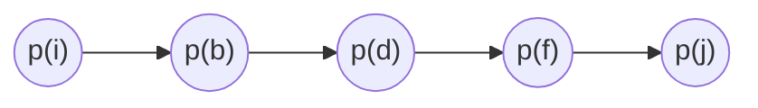
And all this states that we need to step though (inbetween) to get to $p_j$ need to be less or equal $k$ i.e. $(a \leq k) \land (b\leq k)\land (c\leq k)\land (d\leq k)\land (e\leq k) \land (f\leq k)$

The sets $R_{i,j}^k$ can be defined recursively.

- $R_{i,j}^0 \rightarrow$ is a way to forbid any intermediate steps as the index of the states starts at 
	 $R_{i,j}^0=\begin{cases}\{a: & \delta(q_i,a)=q_j & \text{ if } i \neq j\\ \{a: & \delta(q_i,a)=q_j \cup \{\epsilon\} & \text{ if } i = j \end{cases}$  
	How does this look visually.
	In the first case we change state but do not have any states in between.
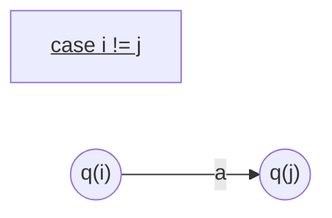

In the second case we do not change state. That means that we have to cover all symbols that lead back to our initial state as well as the $\epsilon$-move.	

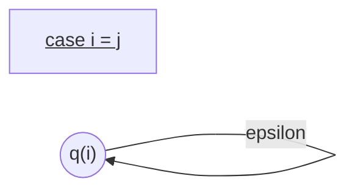

- Now we define $R_{i,j}^k$ by splitting it up in multiple parts
1. The paths from $i$ to $j$ where the intermediate steps are strictly smaller than k i.e. $< k$. This can be expressed as follows:
$$R_{i,j}^{k-1}$$
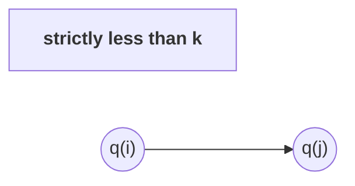
2. The path from $i$ to $j$ where we pass through $q_k$ exactly once. This can be expressed as follows
$$R_{i,k}^{k-1} \cup R_{k,j}^{k-1}$$
 ```mermaid
graph LR
title[<b>pass through q_k once</b>]
qi(("q(i)"))-->qk(("q(k)")) 
qk(("q(k)"))-->qj(("q(j)"))
```
3. And lastly where we pass through $q_k$ multiple times.
> A path from $q_k$ to $q_k$  is part of the class $R_{k,k}^{k-1}$. But we can go from $q_k$ to $q_k$ through different ways again and again passing through other $q_k$. Therefore we create a bigger set of all possible ways to go from $q_k$ to $q_k$ using the [[Kleene-closure|Kleene star]] i.e. $(R_{k,k}^{k-1})^*$
> To explain more: what does $R_{k,k}^{k-1}$ contain?
>  It contains all ways from $q_k$ to $q_k$ i.e. $R_{k,k}^{k-1}=\{R_{k,k}^{k-1})(1),R_{k,k}^{k-1}(2),...,R_{k,k}^{k-1}(n)\}$
>  By using the [[Kleene-closure|Kleene star]] we create a set of set of all combinations of going from $q_k$ to $q_k$ i.e. $(R_{k,k}^{k-1})*=\{\{R_{k,k}^{k-1})(1)\},\{R_{k,k}^{k-1})(1),R_{k,k}^{k-1})(2)\},\{R_{k,k}^{k-1})(2),R_{k,k}^{k-1})(1)\}...\}$

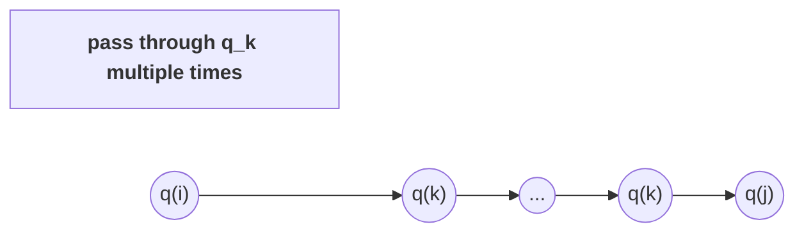
==To summarize==
$$R_{i,j}^k=R_{i,j}^{k-1} \cup R_{i,k}^{k-1} \cdot (R_{k,k}^{k-1})^\star \cdot R_{k,j}^{k-1}$$

>[!Note]
>We are currently using [[Restricted Regular Expression]]s as we only use $\cup,\cdot$ and the [[Kleene-closure|Kleene star]] $\star$

From what we showed we can conclude that for all possible choices for $i,j,k$ there exists a [[Restricted Regular Expression]] that defines $R_{i,j}^k$.

==How can we exploit this sets to define a Language $L(\mathcal{A})$?==

$$L(\mathcal{A})=\underbrace{\bigcup\limits_{q_j \in F} R_{1,j}^n}_{\text{Restricted Regular expression defining} L(\mathcal{A})}$$


## Now we prove from  [[Finite State Automata|FA]] $\leftarrow$ [[Restricted Regular Expression]] 
Goal: we want to turn a [[Restricted Regular Expression]] to a [[NFA with epsilon-move]]. 

Further restriction: We want the resulting [[Deterministic Finite State Automata|Automaton]] have at most one final state without exiting transition . What is a final state without exiting transition? It is a final state from which one can not leave anymore visually speaking $q_3$ would be such a state.

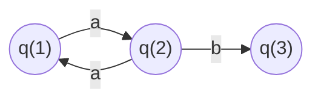

The proof is by induction on the structural complexity of the [[Restricted Regular Expression]] $R$.

### ==Base cases:==
<mark style="background: #FF5582A6;">important:</mark> we denote the final and the initial state by a box pointing towards the initial state.

$R=\{\epsilon\},\emptyset,\{a\}$
- How does the [[Deterministic Finite State Automata|Automaton]] look like for a language $\{\epsilon\}$?
> It has one state, $q_1$, which is also the final state, accepts the empty word, and when it reads the empty word one starts at $q_1$ and ends at $q_1$.
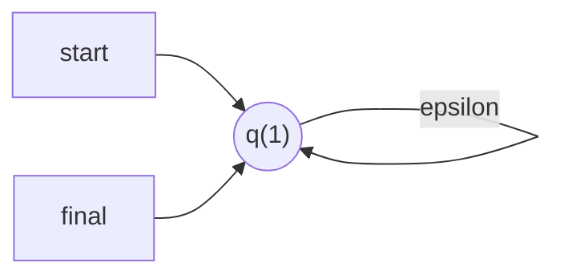
- How does the [[Deterministic Finite State Automata|Automaton]] look like for the emptyset $\emptyset$?
>It does not have a final state as we never can change state as we can not read in a word or $\epsilon$
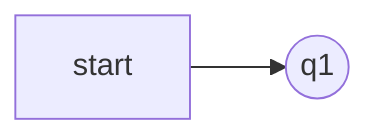
-  How does the [[Deterministic Finite State Automata|Automaton]] look like for a Language with a single [[Symbols|Symbol]] i.e. $\{a\}$
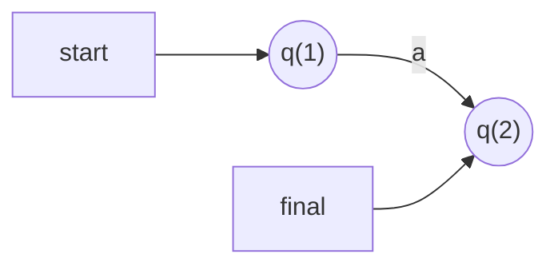

### inductive step
$R$ are [[Regular Expression]]s.
#### 1. case $R=R_1 \cup R_2$
By Hypothesis there exists two [[NFA with epsilon-move]]s:
- $\mathcal{A}_1=Q_1,A,\delta_1,q_1,\{f_1\}$
- $\mathcal{A}_2=Q_2,A,\delta_2,q_2,\{f_2\}$

We assume for that there exist only one final state $f$ for each of the [[Deterministic Finite State Automata|Automata]] without exiting transition. We assume that $\mathcal{A}_1$ recognizes the [[Regular Expression]] $R_1$, $\mathcal{A}_2$ recognizes [[Regular Expression]] $R_2$.
Without the loss of generality we assume that $Q_1 \cap Q_2=\emptyset$ i.e. the two [[Deterministic Finite State Automata|Automata]] have different states.

It is easy to show that the following [[Non Deterministic Finite State Atomata]] $\mathcal{A}$ recognizes the languages $L(\mathcal{A}_1) \cup L(\mathcal{A}_2)$. $\mathcal{A}$ is the following:

 $$\mathcal{A}=\{Q_1 \cup Q_2 \cup \{q_0,f_0\},A,\Delta,q_0,\{f_0\}\}$$
 
What does $Q_1 \cup Q_2 \cup \{q_0,f_0\}$ mean?
> We join the states of $Q_1$ and $Q_2$ but we add a new initial state $q_0$ and a new final state $f_0$. Which are also the initial- and final-state of the [[Deterministic Finite State Automata|Automaton]] $\mathcal{A}$.

Furthermore lets define the [[Transition function]] $\Delta$ where:
$\Delta(q_0,\epsilon)=\{q_1,q_2\}$
> ==What does this mean?== Instead of starting at $q_1$ or $q_2$ we use the new state $q_0$ as start state. Then the next state is, by using the magic of [[Non Deterministic Finite State Atomata|NFA]], either the previous start state of $\mathcal{A}_1$ $q_1$, or of $\mathcal{A}_2$ $q_2$.

$\Delta(q,a)=\Delta_1(q,a)$
> for $(q \in Q_1 - \{f_1\}) \land (a \in A \cup \{\epsilon\})$

$\Delta(q,a)=\Delta_2(q,a)$
> for $(q \in Q_2 - \{f_2\}) \land (a \in A \cup \{\epsilon\})$

> ==what does this mean?== If we are in a state that originally belonged to $\mathcal{A}_1$ then we use the transition function of $\mathcal{A}_1$. If we are in a state that originally belonged to $\mathcal{A}_2$ we use the transition function of $\mathcal{A}_2$. With only one exception: if we are in one of the previous endstates $f_1$ or $f_2$ the now following rule applies.

$\Delta(f1,\epsilon)=\Delta(f_2,\epsilon)=\{f_0\}$
> ==What does this mean?== if we are in one of the previous endstates $f_1$ or $f_2$ and we get an empty word we jump to the new final state $f_0$

How does this visually look? As the sets of states  $Q_1 \cap Q_2=\emptyset$  do not have any states in common the upper branch of automata $A_1$ and the lower branch of $A_2$ do not overlap. We added a state at the start from which you get into the initial states with 50:50 probability in the initial states of $A_1$ and $A_2$. At the final state we do the same trick to lead the endstates of $A_1$ and $A_2$ into the new final state $f_0$. 
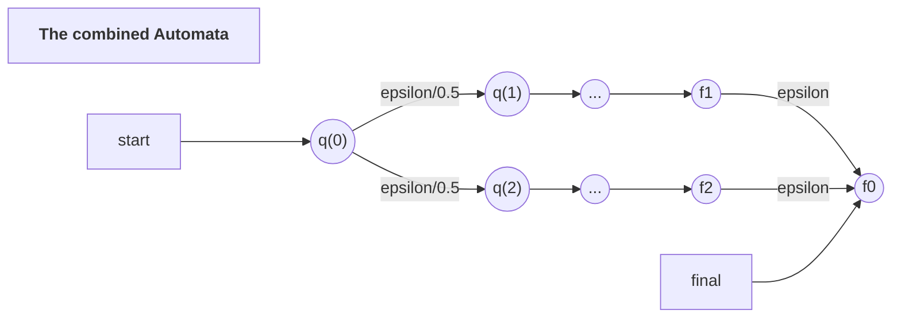
==Note this part was talked about in the 11th lesson.==
#### Second case $R=R_1 \cdot R_2$
In this case we cover words that can be recognised in two parts. The first part of the word can be recognized by $R_1$ the second part of the word can be recognized by $R_2$. This implies that we also have to [[Deterministic Finite State Automata|Automata]] $A_1$ and $A_2$ that recognize the individual parts of the words.

==Goal:==Now we want to build an automaton that by smartly combining $A_1$ and $A_2$ recognizes the entire word $R$.

We reuse the Automata definitions from above. The Automata are again disjoint  i.e : $Q_1 \cap Q_2=\emptyset$

$$\mathcal{A}_1=(Q_1,A,\delta_1,q_1,\{f_1\})$$
$$\mathcal{A}_2=(Q_2,A,\delta_2,q_2,\{f_2\})$$

We just hang the two [[Deterministic Finite State Automata|Automata]] behind each other linked with a $\epsilon-move$.

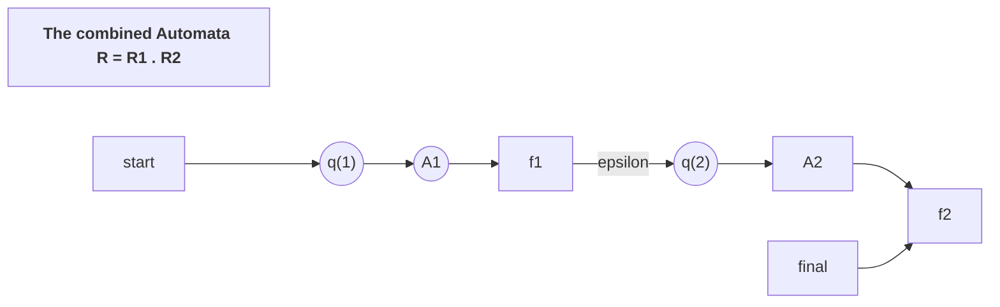

Question: how do we avoid the epsilon move?  We just connect all states from where we get from the startstate $q_2$ of $A_2$ using a symbol to $f_1$. We are not able to delete $q_1$ as it is still possible to go back to the initial state. See image:
![[Verification 10_image_1.png|700]]

==Important:== We can do the proof entirely without epsilon move as [[Non Deterministic Finite State Atomata]], [[Non Deterministic Finite State Atomata]] with epsilon move and [[Deterministic Finite State Automata]] have the same [[expressiveness]]. 

#### 3. Case $R=R_1^\star$
As the idea of the [[Kleene-closure|Kleene star]] is to have all possible concatinations of all possible words  it must be possible to go from the end state to the intitial state.

1. step the automaton needs a path from the final to the initial state.

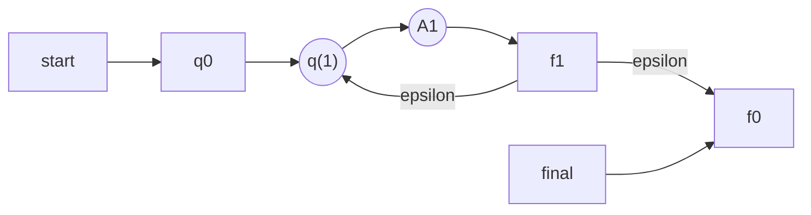

2. The upper [[Non Deterministic Finite State Atomata]] is not done.The [[Kleene-closure|Kleene star]] has a special case that is the empty set i.e we need a option to go to the final state without any symbols. ==This is the final [[Non Deterministic Finite State Atomata]]== 

<b>The combined Automata R = R1*</b>
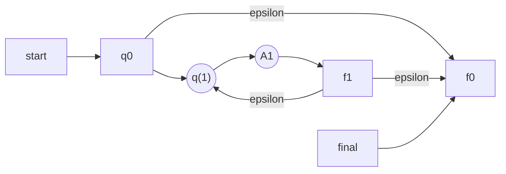

It immediately follows that [[Restricted Regular Expression]]s define [[Regular Expression]]s

---