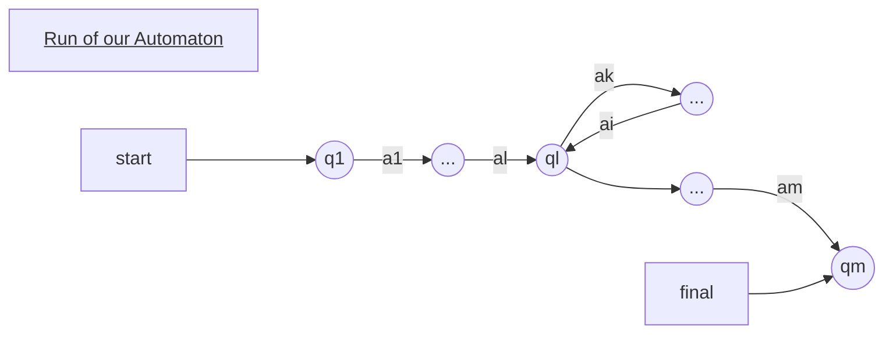
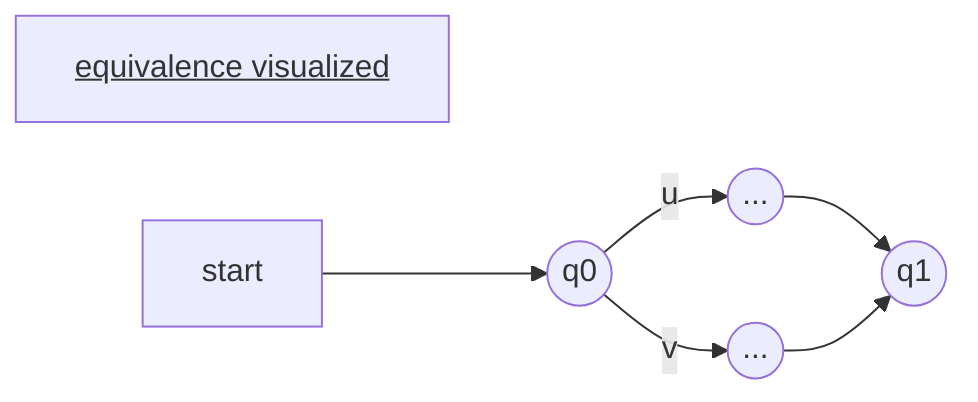
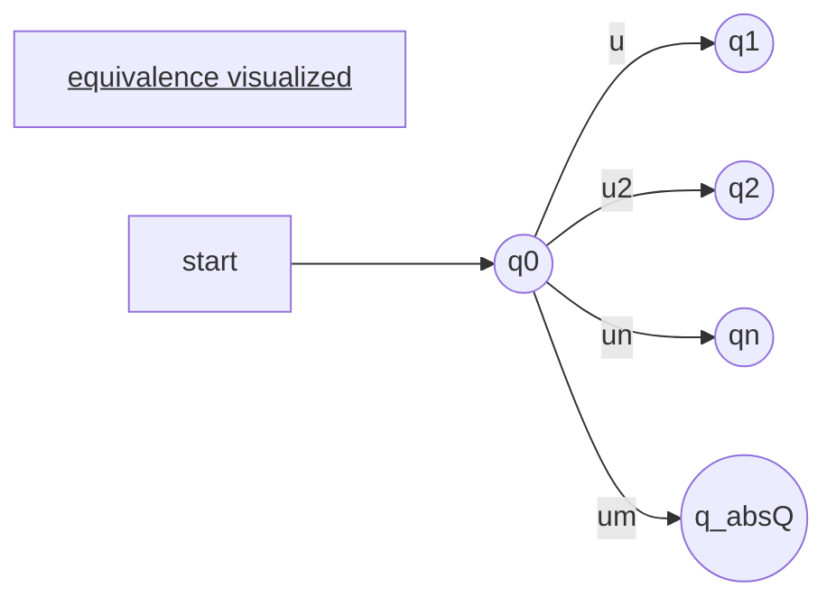

# 1 Regular Languages
Today we want to finish the topic of regular language.
In particular decision problems.


Last time we saw:

- [[Theorem 5|Closure Property]] under $\cup,\cap,\neg$

Today we will see
- [[Decision Problems]] with [[Deterministic Finite State Automata|Automata]] 
	- [[Decision Problems]] we have already seen are: [[Satisfiability]], [[Validity]]. This were [[FO - First order logic|FO]] problems. But it is always possible to transfer a [[FO - First order logic|FO]] problem to a [[Deterministic Finite State Automata|Automaton]] 
	   The [[emptyness problem]] is the logical equivalent of the [[Satisfiability]] problem.
	
## 1.1 The [[emptyness problem]]
	
==input==: A [[Non Deterministic Finite State Atomata|NFA]] $\mathcal{A}$
==output==: yes if $L(\mathcal{A}) \neq \emptyset$ meaning: The language of the automaton is non-empty.

What might be possible outcomes:
1. example: we can create a word that the [[Deterministic Finite State Automata|Automaton]] accepts -> The language of the [[Deterministic Finite State Automata|Automaton]] is not empty
2. Another example: Even though the [[Deterministic Finite State Automata|Automaton]] is huge, the final state is not reachable -> empty language 


### 1.1.1 [[Lemma 11]]
> [!note] [[Lemma 11]]
> For every [[Non Deterministic Finite State Atomata|NFA]] $\mathcal{A}$ the [[Language]] $L(\mathcal{A}) \neq \emptyset$ if and only if there exists a word $w$ which is an element of its alphabet $A$ is element of the language $L(\mathcal{A})$ and has less symbols than the number of states i.e. $|w|<|states|$

==Shortform:==  If you can find a word $w$ for an [[Deterministic Finite State Automata|Automaton]] it has less symbols than there are states in the [[Deterministic Finite State Automata|Automaton]]

#### 1.1.1.1 Proof:
DIrection 1. if we have a short word and it is part of the language then we can find an automaton to accept it. I.e. no proof necessary -> trivial

Direction 2: If we have a non-empy [[Language]] can we find a word with less symbols than there are states.

We will proof direction two by ==proof through [[contradiction]]==!

We have a language $L$ that is not empty i.e. $L(A) \neq \emptyset$.

We also assume that for every word $w$ of the Language $L(A)$  ($w \in L(A)$) the length of the word $|w|$ is bigger than $n$ while $n$ is the number of states in the [[Deterministic Finite State Automata|Automaton]] $\mathcal{A}$.  i.e. $|w|>n$

Further we assume a word $w_0 \in L(A)$ that has the minimal length. i.e $\forall w \in L(A): w\geq w_0$

So lets do a run of the imaginary word $w$ through a arbitrary [[Deterministic Finite State Automata|Automaton]] $\mathcal{A}$. It has $m$ symbols and due to our assumption $m$ needs to be greater or equal to $n$. as the shortest possible word $w_0$ has $n$ symbols 
i.e.: $m \geq n$

So: $w_0=a_1 \cdot a_2 \cdot ... \cdot a_n$

 ```mermaid
graph LR
title[<u>Run of our Automaton</u>]
start --> q1
q1((q1))--a1-->q2((q2))--a2-->dot((...))
dot--am-->qm((qm))
final-->qm
```

The transition function is defined as follows:
$$q_i:=\delta(q_0,a_1\cdot a_2 \cdot ... \cdot a_i)$$
This means when we want to reach the state $q_i$ we start at state $q_0$ and apply all symbols from $a_1$ to $a_i$ then the state that we end up in is $q_i$

Another observation that we can do is:
Because due to our assumption that the word $w_0$ is the minimal word but still the word has more or a similar amount symbols than  $n$  (Where $n$ is the # of states of $A$) we can assume thatt we have to pass through one state multiple times i.e.:
$$\exists i<j:q_i=q_j$$


What does this mean practically: We have a circle in our [[Deterministic Finite State Automata|Automaton]]. Then our Automaton must look somehow like this:



==We have a circle==

But if the word $w_0$ has to take the circle there is also a shorter word $w_1$ that just skips the circle. 
This word $w_1$ is also part of $L(A)$ and is also strictly shorter than $w_0$ i.e.

$w_1 \in L(A)$ and $|w_1|< |w_0|$

==[[contradiction]]==

How is this usefull?
When we want to find a accepted word. We just need to check all paths through our [[Deterministic Finite State Automata|Automaton]] with length smaller or equal $n-1$.

### 1.1.2 [[Corollary 3]]
> [!note] [[Corollary 3]]
> To know wheater a language is non empty one can remove all states of an automaton $\mathcal{A}$ that are not reachable from the initial state $q_0$. Then one can check if a final state is remains. If there exists a final state the Language is non-empty.

#### 1.1.2.1 What is the complexity to remove all non reachable state?
One can launch a [[depth first search]]. With this algorithm  we mark all states that are reachable. Then if a final state is still existing the language is non empty.  This algorithm is linear time with the automaton.


[[Corollary 3]] implies that the (non)-[[emptyness problem]] of the [[Non Deterministic Finite State Atomata|NFA]]  is in [[P-Time]].


## 1.2 The [[Universality problem]] of [[Non Deterministic Finite State Atomata|NFA]]
- Is [[logical equivalence|logically equivalent]] to the [[Validity]] of a Formula.

In this problem we check weather the set of accepted words  is equal to the entire [[Alphabet]]  of the [[Deterministic Finite State Automata|Automaton]] i.e.
$$L(\mathcal{A}) = A^\star$$

==input:== [[Non Deterministic Finite State Atomata|NFA]] $\mathcal{A}$  over the Alphabet $A$
==output:== Yes if the [[Deterministic Finite State Automata|Automaton]] accepts every word of the alphabet

How do we solve such a problem similar to the [[Validity]] problem in [[FO - First order logic|FO]].

We form the [[Complementation|complement]] of the Automaton $\neg \mathcal{A}$.  It accepts the complement of the  language of $\mathcal{A}$ which we call $\mathcal{B}$.  i.e.
$A^\star$ -> All possible words creatable from the alphabet of A
$L(\mathcal{A})$ -> Set of words that are accepted by $\mathcal{A}$
$L(\neg \mathcal{B})= A^\star - L(\mathcal{A})$

If the [[Complementation|complemented]] Automaton does not exist we know that the original [[Deterministic Finite State Automata|Automaton]] is accepts all words.

==Complexity==
With a [[Non Deterministic Finite State Atomata|NFA]] will be [[EXP-Time]] and is [[P-space complete]]
With a [[Deterministic Finite State Automata|DFA]] it is [[P-Time]]

## 1.3 The [[Equivalence problem]]
- is the logical equivalence of [[logical equivalence]] in [[FO - First order logic|FO]]

==input:== two [[Deterministic Finite State Automata|Automata]] $\mathcal{A}_1$ and $\mathcal{A}_2$ 
==output:== Yes if $L(\mathcal{A_1})=L(\mathcal{A_2})$


GIven are two [[Deterministic Finite State Automata|Automata]] $\mathcal{A}_1$ and $\mathcal{A}_2$. The [[Equivalence problem]]  returns yes if the two [[automaton]] accept the same language i.e.:
$$L(\mathcal{A_1})=L(\mathcal{A_2})$$


## 1.4 [[Containment problem]]

==input:== two [[Deterministic Finite State Automata|Automata]] $\mathcal{A}_1$ and $\mathcal{A}_2$ 
==output:== Yes if $L(\mathcal{A_1}) \subseteq L(\mathcal{A_2})$


GIven are two [[Deterministic Finite State Automata|Automata]] $\mathcal{A}_1$ and $\mathcal{A}_2$. The [[Containment problem]]  returns yes if the $\mathcal{A_1}$ accepts all words of the language of the [[Deterministic Finite State Automata|Automaton]] $\mathcal{A_2}$
$$L(\mathcal{A_1})=L(\mathcal{A_2})$$

### 1.4.1 Interreducability of the [[Equivalence problem]] and the [[Containment problem]]
#### 1.4.1.1 Equivalence can be rewritten using the [[Containment problem]] by:
$$L(\mathcal{A}_1)=L(\mathcal{A}_2) \iff L(\mathcal{A}_1) \subseteq L(\mathcal{A}_2) \cap L(\mathcal{A}_1) \supseteq L(\mathcal{A}_2)$$


#### 1.4.1.2 The [[Containment problem]] can be rewritten using the [[Equivalence problem]] by:

Using the [[Intersection]] we can define three ways:
The following three statements define containment using [[Intersection]], [[complement]] and [[Equivalence problem|equivalence]].
$$L(\mathcal{A_1}) = L(\mathcal{A}_1) \cap L(\mathcal{A_2}) \iff \mathcal{A}_1 \subseteq \mathcal{A_2}$$
$$L(\mathcal{A_1}) = L(\mathcal{A}_1 \cap \mathcal{A_2})\iff \mathcal{A}_1 \subseteq \mathcal{A_2}$$
$$L(\mathcal{A}_1) \cap \neg L(\mathcal{A}_2) = \emptyset \iff \mathcal{A}_1 \subseteq \mathcal{A_2}  $$

This means that you can either use the intersection of the accepted languages of the automata i.e. $L(\mathcal{A}_1) \cap L(\mathcal{A_2})$ or one can use the accepted language of the [[Deterministic Finite State Automata|Automata]] i.e. $L(\mathcal{A}_1 \cap \mathcal{A_2})$

## 1.5 What happens if we have two different [[Deterministic Finite State Automata|Automata]] one beeing [[Non Deterministic Finite State Atomata|NFA]] and the other one [[Deterministic Finite State Automata|DFA]]?

The advantage is that [[DFA]]s can easily be complemented.

When we use the formula: 
$$L(\mathcal{A}_1) \cap \neg L(\mathcal{A}_2) = \emptyset \iff \mathcal{A}_1 \subseteq \mathcal{A_2}$$

We set the [[Deterministic Finite State Automata|DFA]] to be $L(\mathcal{A_2})$ as the [[Complementation|complement]] can be calculated in [[Linear time]]. The intersection is [[P-Time]] ([[P-Time|polynomial time]]). 

This means that we have an ==Advantage== when we have two [[Deterministic Finite State Automata|Automata]] from different classes as we can calculate the [[Containment problem]] in [[P-Time|polynomial time]]. Previousely it had the complexity of [[P-Space]].

# 2 [[Theorem 6]] aka [[Theorem 6|Myhill-Nerode Theorem]] 
> [!note] [[Theorem 6|Myhill-Nerode Theorem]]
> Let L be a Language over the Alpabet $A^\star$ i.e.: $L \subseteq A^\star$. $L$ is ==any== Language.
> Then the following conditions are equivalent:
> 1.  $L$ is [[Regular Languages|regular]]
> 2.  There is a [[Equivalence problem|equivalence relation]] $\approx$ over words element of $A^\star$ that is [[finite index]] (i.e. has a finite amount of equivalence classes) and is [[right invariant]] such that $L$ is a union of [[Equivalence problem| equivalence classes]] ($\approx-classes$) .
> e.g.
>  $L=[u_1]_{\approx} \cup [u_2]_\approx \cup [u_3]_\approx \dots$ 
> ($[u_1]_\approx$ is the class of all words that are equivalent to the word $u_1$)
> 3. Some particular equivalence $\approx_l$ is [[finite index]]
>  > $\approx_L$ is defined as:
>  > $u \approx_L v \quad \iff  \quad \forall t \in A^\star \hspace{0.5em} ( u \cdot t \in L \iff v \cdot t \in L)$

==Example union of  [[Equivalence problem|equivalence classes]] :==
What is not a union of [[Equivalence problem|equivalence classes]]?

Lets take the language $L$ of all words which length is a prime number i.e. $isprime(len(w))=true$

Now we define a two equivalence classes as the length of the word modulo 2:
1. class $mod(len(w))=1$
2.  class $mod(len(w))=0$

The Language L is not a union of equivalence classes because not all words with uneven/even length are prime. Some words of the language are part of the equivalence class  $mod(len(w))=1$ others are part of the equivalence class  $mod(len(w))=0$

==Examples to [[Theorem 6|Myhill-Nerode Theorem]]:==
$L = (ab)^\star$ 
Lets look how the application of $\approx_L$ would look like:

$ab \approx_L abab$ is true as:
$\forall t$:
$ab \cdot t \in L \iff  t = ab...ab$
$abab \cdot t \in L \iff  t = ab...ab$
From here it becomes clear that $ab \approx_L abab$

$aba \approx_L a$ is true as:
$\forall t$:
$aba \cdot t \in L \iff  t = ba...ab$
explanation: $aba \cdot t$ is only element of $L$ if $t$ starts with a $b$ 
$abab \cdot t \in L \iff  t = ab...ab$
From here it becomes clear that $ab \approx_L abab$
The same is true for a:
$a \cdot t \in L \iff  t = b...ab$

Now a counter example:
$a \not\approx_L ab$ as:
if we set $t=b$
$a \cdot t \in L \iff  t = b$
==but==
$ab \cdot t \not\in L \iff  t = b$

Now another set of examples:
$b \not\approx_l a$
$\epsilon \approx ab$


To summarize: What are the [[Equivalence problem|equivalence classes]] for $L=(ab)^\star$

1. $[\epsilon]_{\approx_L}$ = $\{\epsilon,ab,abab,...\}$ -> in $L$
2.  $[a]_{\approx_L}$ = $\{a,aba,ababa,...\}$ -> not in $L$ but can be made to words of $L$ by some action. E.g concatenation
3. $[b]_{\approx_L}$ = $\{b,ba,bb,bbb,...,aa,...\}$ -> not in $L$ and will never be in $L$

$L = [a]_{\approx_L}$ -> L is the union of 1 equivalence class

What are other regular languages that one could come up with:
==Example 1==
$L'=(ab)^\star a \cup b(a+b)^\star$ which can be expressed as the union of two equivalence classes: $[a]_{\approx_L} \cup [b]_{\approx_L}$

==Example 2==

$L = {palindromes}$ is not a [[Regular Languages|Regular language]] but how do you proove it? One needs to show the equivalence classes:

1. $[\epsilon]_{\approx_L}$
How do we show this?
We show that $\forall u,v \hspace{0.5 em} (u\approx_L v \iff u=v$)
Suppose $u \not= v$ we define $t = (reverse(u))$

$u \cdot reverse(u)$ $\in L$ -> a palindrome
$v \cdot reverse(u)$ $\in L$ -> not a palindrome

From this observation we can see: $u \not\approx_L v$.

There is an infinite amount of equivalence classes:
$[u]_{\approx_L}=\{u\}$

And from point 3  of the [[Theorem 6|Myhill-Nerode Theorem]] we can see that $L$ is not a [[Regular Languages|Regular language]]

---
break

---

## 2.1 Proof [[Theorem 6|Myhill-Nerode Theorem]] 
We will proof it in three steps.

1. We will proof from statement 1 -> 2
2. Then we will proof from statement 2 -> 3
3. Then we proof from 3 -> 1 

### 2.1.1 Proof 1 -> 2
Suppose $L$  is [[Regular Languages|Regular]]. 
This means it is represented by some [[Deterministic Finite State Automata|Automaton]].
$\mathcal{A}=(A,Q,\delta,q_o,F)$ be a [DFA](Deterministic%20Finite%20State%20Automata.md). 
$\mathcal{L}(\mathcal{A})=L$ i.e. The language accepted by the [[Deterministic Finite State Automata|Automaton]] $\mathcal{A}$ is $L$.

We have to define some equivalence $\approx$ of [[finite index]] which is [[right invariant]] so that $L$ is a [[Union]] of the [[Equivalence problem|equivalence-classes]] $[...]_\approx$.

Define $\approx$ as follows:
$u \approx v$ whenever $\tilde{\delta}(q_o,u)=\tilde{\delta}(q_0,v)$

What does this mean:
If one has an [[Deterministic Finite State Automata|Automaton]] and we start in a certain state $q_0$ and have as input the word $u$ and end up in the state $q_1$. Then $v$ is [[Equivalence problem|equivalent]] when we start in the state $q_0$ input $v$ and end up in the same state $q_1$ as if we had input $u$. Visualized




> [!note] repetition what is $\delta$
> Is a function taking in states and letters or words and returns States.
> $\delta: Q \times A ->Q$, but extended to $\tilde{\delta}: Q \times A^\star \rightarrow Q$

#### 2.1.1.1 [[finite index]]
Note: Why is $\approx$ finite index because: __We have a finite number of states in the [[Deterministic Finite State Automata|DFA]] and thats the upper bound for [[Equivalence problem|equivalence classes]]__. That means: ==$\approx$ is [[finite index]]==.This follows from how many different words we can find that end up in a different state $q_x \not= q$. This is $|Q|-1$ so the number of states -1 because $q$ is the state for equivalence.



#### 2.1.1.2 [[right invariant]] 
> [!note] What is [[right invariant]]
> $\forall u,v,t \qquad u \approx v \implies u \cdot t \approx v \cdot t$
> 

By definition when $u\approx v$ then:
$$\delta(q_o,v)=\delta(q_0,u)$$
Take an arbitrary $t \in A^\star$ from the definition of $\tilde{\delta}$ we know:
$\tilde{\delta}(q_0,u\cdot t)=\tilde{\delta}(\delta(q_0,u),t)$ therefore we can substitute $\delta(q_0,u)$ by $\delta(q_0,v)$ or by their common final state $q$. Therefore we can say:
$\tilde{\delta}(q_0,u\cdot t)=\tilde{\delta}(q_1,t)=\tilde{\delta}(\delta(q_0,u),t)=\tilde{\delta}(\delta(q_0,v),t)$ which means that ==$\approx$ is [[right invariant]]!==

#### 2.1.1.3 $L$  is a [[Union]] of Classes
Definition of accepted words:
$L =\{w \in A^\star |\delta(q_0,w) \in F\}$

We can also write this with a union:

$L = \underset{q \in F}{\cup} \{w \in A^\star | \delta(q_o,w) = q \}$

The  definition via a [[Union]] is basically a [[Equivalence problem|equivalence class]]

We assume without the  loss of generality that $\mathcal{A}$ is [[prune|pruned]].  Hereby we do not have any empty equivalence classes.

For every $q \in F$ (reachable from $q_0$)

Let $w_q \in A^\star$ so that $\delta(q_0,w_q)=q$

Now we define the Language $L$ by all words that reach the states.

$L = \underset{q \in F}{\cup}\hspace{0.25em} [w_q]_\approx$

### 2.1.2 Proof 2-> 3
Assume that $\approx$ is [[finite index]], [[right invariant]] and $L$ is a [[Union]] of [[Equivalence problem|equivalence classes]]

==Goal==: Proof that $\approx_L$ is finite index where $\approx_L$ is defined as:
 > $u \approx_L v \quad \iff  \quad \forall t \in A^\star \hspace{0.5em} ( u \cdot t \in L \iff v \cdot t \in L)$
 
#### 2.1.2.1 Subgoal 1.
 prove that $\approx$ [[refine]] $\approx_L$. One equality relation [[refine]]s the other if:
> [!note] refine
> Is a feature of equality relations.  Where $\approx$ and $\approx_L$ are two equality relations.
> $\approx$ refines $\approx_L$ if:
> 
> $\forall u,v \qquad u \approx v \implies u \approx_L v$ 

Note:
Because $\approx$ refines $\approx_L$ and $\approx$ is [[finite index]] this implies that $\approx_L$ is also [[finite index]].

Visually speaking it looks like this:

![[Verification 12_image_1.png|500]]

With $[ \approx_L]$ being the class being refined. And the big white bars defining the [[Equivalence problem|equivalence classes]] of the set. This shows that if $\approx$ has finitely many  [[Equivalence problem|equivalence classes]], $\approx_L$ also has finitely many equivalence classes.

Lets start with the proof of Subgoal 1:
We assume $u \approx v$

Because $\approx$ is [[right invariant]] this implies that:
$$\forall t \in A^\star \qquad u \cdot t \approx v \cdot t$$

We know that $u \cdot t$ belongs to $L$ and because of [[right invariant|right invariance]] also $v \cdot t \in L$ and vice versa.

So this proves that $u \approx_L v$ and hereby that $\approx_L$ [[refine]]s $\approx$ because every $u$ and $v$ that are equivalent in $\approx_L$ are also equivalent in $\approx$.

### 2.1.3 Proof 3 -> 1
Completed in [[Verification 13]] 