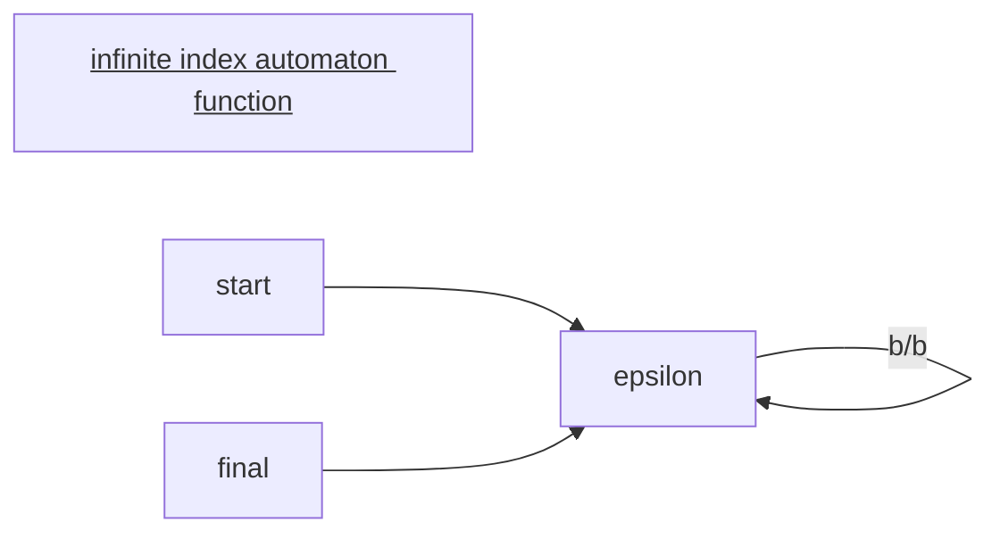

#AngeloMontanari
# 1 Examples for the [[Hankel matrices]]
## 1.1 Standard automata

![[Verification 15_image_1.png]]

The resulting [[Deterministic Finite State Automata|Automaton]] is the correct one.

The Language $L_0$ is $L_0 = ((a+b)a)^\star$ i.e. it has a $b$ in every odd position. 

# 2 Functions on words
For instance a function $f$ that maps words from one [[Alphabet]] to another i.e. $\Sigma^\star \to \Gamma^\star$.

A function is a [[Deterministic Finite State Automata|Automaton]] with output. The simplest one is the [[Sequential Transducer]]

 
![[Verification 15_image_2.png]]

The example in the upper part of the slide is an example for the automaton in the lower part of the slide and is a [[Sequential Transducer]]. It can exchange a input word $w$ for instance $w=a$ by another word $w'$ for instance $w'=ac$.

The notation in the painting $a/ac$ means that for every $a$ read in at that state in the automaton is exchanged by a $ac$. And $b/bc$ means for every $b$ read in it is exchanged by a $bc$. $a/a$ means $a$ stays the same.

[[Sequential Transducer]]s are quite weak they can only compute total, [[monotone functions]]. i.e.

> [!note] monotone functions
> $f$ is [[monotone functions|monotone]] if every word $w$ read in by the [[Deterministic Finite State Automata|Automaton]] is a [[prefix]] of the output word $w'$

## 2.1 How does the learning algorithm for [[monotone functions]] work?

It is very similar to the normal learning game.
![[Verification 15_image_3.png]]

Now we need to find something similar to the [[Theorem 6|Myhill-Nerode equivalence]] for learning for functions. The old one only works on [[Deterministic Finite State Automata|Automata]] not on functions.

The [[Theorem 6|Myhill-Nerode Theorem]] for functions is the following:

An easy approach would be $$u \approx_{f_0} v \text{ if } \forall_t \in \Sigma^\star f(ut) = f(vt)$$ but there are problems:

This equivalence would be not [[finite index]].

One [[Deterministic Finite State Automata|Automaton]] with [[finite index|infinte index]] would be for instance

The [[Deterministic Finite State Automata|Automaton]] function leaves the words unchanged. i.e $f_0(w)=w$.

$$u \neq v \text{ for }  t=\epsilon$$
$$f_0(u\cdot t)=u \neq f_0(v \dot t) = v$$

i.e. for every word there is a new equivalence class i.e. infinitely many equivalence classes. 

To have [[finite index]] you would want all the words to fall in one equivalence class because we only have one state.

The [[Theorem 6|Myhill-Nerode equivalence]] for functions is the following:

$u \approx_{f_0} v \text { if } \forall t \in \sum^* \quad f_0(u t)-f_0(u)=f_0(v t)-f_0(v)$

Lets look at an example:

![[Verification 15_image_4.png]]

There are two classes $[\epsilon_{\approx_{f_{0}}}]$ containing all even length words and $[a_{\approx_{f_{0}}}]$ containing all odd number words.

The $?$ stand for  a letter which form we do not know because it is part of the input.

example for the minus
$$ababa - aba = ba$$
$$bbca?c??c-bbca= ?c??c$$

What are properties of the [[Theorem 6|Myhill-Nerode equivalence]] for functions?
- It is right invariant
- it has finite index if and only if  $f$ is computed by a [[Sequential Transducer]].

## 2.2 [[Hankel matrices]]  for [[monotone functions|monotone]] word functions

Instead of 0 and 1 we will have words in the [[Hankel matrices]].

The name of a equivalence class is created by concatenating the words of each field in the from left to right where we have a test word.

For instance in the first row if our test words would be $T=\{\epsilon, b,aa\}$ the class name would be: $\epsilon baac$

![[Verification 15_image_5.png]]

Now we do a new example:
Example:

![[Verification 15_image_6.png]]

![[Verification 15_image_7.png]]

Counterexample is $w=ab$ but we also need to add the suffix which is $w=b$

Now $a$ is in a different equivalence class than $\epsilon$. (the red columns are not the same anymore (for instance in the b column $ab ->bc$ but $\epsilon b -> b$ ))

Therefore we add $a$ to $S$ so that $\epsilon \cdot a$ as well as $\epsilon \cdot b$ have a element ($a$) in the same equivalence class.

---
break

---

# 3 Fair Transition Systems 

We want to change from finite [[Deterministic Finite State Automata|Automata]] to infinite [[Deterministic Finite State Automata|Automata]]. 

Why do we need this: Its everywhere!

For instance: A printer runs infinitely.

What does [[Fair]] mean in the sense of [[Deterministic Finite State Automata|Automata]].

It means that if an [[Deterministic Finite State Automata|Automata]] receives a request, sooner or later it will fullfill the demand.

There are multiple [[Fair|Fairness]] conditions.

Exercises: There are exercises in the book of Manner and Pnueli -> chapter 0 of book 2.

# 4 [[Fair Transition Systems]]

Representation: 
- Finite set of Variables: $\mathcal{V}$  
	- The variables are typed: int, Boolean...
- for every variable $x \in \mathcal{V}$ in that is associcated with a state there exist a variable $x' \in \mathcal{V}$ that is assocciated with the next state i.e. after applying the successor function.

[[Fair Transition Systems]] can be described by [[FO - First order logic|FO]]. 

A __state__ is an interpretation of $\mathcal{V}$ that assignes to each variable $v \in \mathcal{V}$ a value $s[v]$ belonging to the domina of $v$. 
$\Sigma$ is the set of all __states__

---
$$\{V,\Theta,\mathcal{T},\mathcal{J},\mathcal{C}\}$$
- $V=\{u_1,...,u_n\}$ is a set of variables
$V$ is split up into 
	- [[control variables]] -> a variable describing where in the process of the state we are right now
	- [[data variables]] -> data

$\Theta$ is a satisfiable state formula that characterizes the intial state of the system. A state that satisfies $\Theta$ is a initial state.

$\mathcal{T}$ is a finite set of __transitions__
	- each transition $t \in \mathcal{T}$ is a function that maps each state $s$ of $\mathcal{T}$ to a set of states i.e. $t(s)$
	-  $t(s)$ is called a $t-successor$ of s
	- $t$ is enabled in $s$ if $s$ has successor states i.e. $t(s) \neq \emptyset$. In some states $t$ will be enabled in other disabled.

This three components would be a classic [[Transiton System]]

[[Justice]]: $\mathcal{J} \subseteq \mathcal{T}$
Is the set of transitions for which we demand [[Justice]]. For these states it is not possible that a state is always enabled but never taken. The state needs to be taken at least once.

In the printer example: There would be no [[Justice]] if Printers that are always ready to print but are never chosen to print anything

[[Compassion]] $\mathcal{C} \subseteq \mathcal{T}$
Are the states that have [[Compassion]]. This means  that the states if they are enabled and disabled in  a certain pattern but infinitely many times  They need to be taken from time to time.

Printer example:
A printer is sometimes ready to print and sometimes not. From time to time it is taken to print.

[[Compassion|strong fairness]] $\implies$ [[Justice|weak fairness]] 

> [!note]
> it is not possible to check if a computation satisfies [[Justice]] or [[Compassion]]

## 4.1 How do we represent transitions $t \in \mathcal{T}$
They can be represented by a first order logic relation $\rho_t(\mathcal{V},\mathcal{V}')$.

Example: we want to increment $x$ by one i.e. the transition function is:  $x'=x+1$.
This means that the state of $x$ in the next state $s'$ i.e. $(s'[x])$  is equal to the value of $x+1$.

## 4.2 Enabling conditions
We can express the enabling condition of a transition $t$ i.e. $En(t)$ by the formula $\exists V' \rho_t(V,V')$.
This means that there is at least one state $V'$ (being the successor state) so that the logical relation $\rho_t(V,V')$ is satisfied ($V$ is the current state).

### 4.2.1 [[idling transition]]
There is always the [[idling transition]] $\rho_I$ it means that no variable changes i.e. $V'=V$.

We can see finite computation as as special case of infinite computation. In finite computation, once we have reached our final state we just run the [[idling transition]] infinitely many times.

All transitions different from the [[idling transition]] are called [[diligent transitions]]

$t_I$ is never has [[Justice]] nor [[Compassion]].

