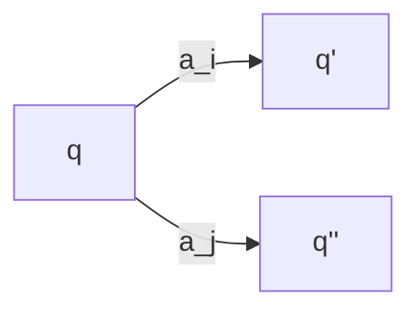

Example of a [[Buechi automata]]:
$A=\{a,b,c\}$
$L=$ the language over the alphabet $L$ such that between two consecutive occurrences of $a$ there is a even number of occurrences of the other symbols.

$abbcba$ -> valid
$abbca$ -> invalid

$F=q_1$
$q_3$ -> sink which is not the final state to go infinitely to a state that is not the final state to indicate that the word has not been accepted

Why do we not make $q_2$ as a final state? It does not matter. If we do $q_2$ as a final state it does not change the behavior as we pass also infinitely many times through $q_1$ as well as $q_2$

==note:== the transition from $q_2$ to $q_3$  is not marked it should move to $q_3$ if a $a$ is read in.

![[Verification 20_image_1.jpeg]]

# 1 Closure properties
The [[Finite State Automata]] are closed towards certain operations against what operations are [[Buechi automata]] closed against.

> [!note] [[Theorem 8]]
> 1. if $V \subseteq A^*$ is regular, then $V^w$ is [[w-regular]].
> 2. If $V \subseteq A^*$ is regular and $L \subseteq A^w$ is [[w-regular]], then $V \cdot L$ is [[w-regular]].
> 3. $L_1,L_2 \subseteq A^w$ are [[w-regular]], then $L_1 \cup L_2$ and $L_1 \cap L_2$ are [[w-regular]] as well.

What does $V^w$ means? A word $v \in V^w = v_0,v_1,v_2,v_3...$ and every $v_n$ is in $V$.

That means this are the infinite word obtained by concatinating the individual words of the finite word language $V$ after each other infinitely many times.

==the proves of this theorem is in [[exercises session 20]].==

---
brake

---

[[Theorem 5|Closure Property]] reduces all interesting problems to the [[emptyness problem]]. For instance the [[Model-checking]] problem.

How do we find the complement of a language in the infinite case? Rather easy in the finite case: all final cases become not finite cases, the non-final states become the final states.

## 1.1 prove property 1 of [[Theorem 8]]

if $V \subseteq A^*$ is regular, then $V^w$ is [[w-regular]].

Let $\mathcal{A}=\{Q,A,\Delta, q_0,F\}$ be a [[Buechi automata]] that recognizes $V$.

Since $V^w=(V-\{\epsilon\}])$, we assume that $\epsilon \notin V$ .

Remember: $\alpha = v_0,v_1,v_2,v_3...$

A [[Buechi automata]] for $V^w$ can be obtained from $\mathcal{A}$ by adding 

2 possiblities:
	- go to final state $q_f$
	- go back to the start $q_0$
Necessary: make $q_0$ also ==a final state==.

![[Verification 20_image_2.jpeg]]

2 changes:
- $(s,a,q_f) \rightarrow (s,a,q_0)$
- $q_0$ becomes final state of the [[Buechi automata]] and becomes another final state.

==Why do we not replace the other $q_F$?==
Sometime we pass through a final state before arriving at the goal final state, if we do remove $q_F$ we can not use it as a transition state. 

### 1.1.1 From regular expressions to [[w-regular|w-regular-expressions]]
> [!note] Definition [[w-regular|w-regular-expression]]
> An [[w-regular|w-regular-expression]] has the form $\cup_{i=1}^n \quad U_i \cdot V_i^w$ where $U_i$ and $V_i$ are regular expressions for $i=1,...,n$

$\alpha = u \cdot v_0 \cdot .... v_n$ for some $i$
where $u,v_n \in V_i$

let us connect [[w-regular|w-regular-language]]s (languages recognized by [[Buechi automata]]) and [[w-regular|w-regular-expression]]s.

The construction is the following:

Let $\mathcal{A}=\{Q,A,\Delta, q_0,F\}$ be a [[Buechi automata]], with the word $w \in A^*$. and  $s, s^` \in Q$ which are two states.

We denote by $s \rightarrow_w s^`$ the exsistence of a computation of the $\mathcal{A}$  on $w$ that leads us from $s$ to $s^`$.

![[Verification 20_image_3.jpeg]]

An example:
$$s \rightarrow s^`$$
For each pair of states $s,s^` \in Q$ we define $w_{s,s^`}$ is a regular language.

$\mathcal{A}_{ss^`}=(Q,A,\Delta,q_0=\{s\},F=\{s^`\})$

> [!note] [[Theorem 9]]
> For all [[Buechi automata]] there exists a [[w-regular|w-regular-expression]] that defines the same language

A sucessful computation of a [[Buechi automata]] always looks like this:

![[Verification 20_image_4.jpeg]]

All states that allow me to go from $q_0$ to $s$. i.e. $w_{q_0,s}$. Then we have a word that repeats infinitely many times and goes from $s$ to $s$ i.e. $(w_{ss})^\omega$ . Together this is:

$$w_{q_0,s} \cdot (w_{ss})^\omega $$
[[w-regular|w-regular-expression]] that captures the language recognized by the [[Buechi automata]].

# 2 Proof [[Theorem 9]]

1. direction [[w-regular|w-regular-expression]] $\to$ [[Buechi automata|Buechi-automaton]]

[[w-regular|w-regular-expression]]s have the form $\cup_{i=1}^n U_i \cdot V_i^w$ where $U_i,V_i$ are  [[Regular Expression]]s for all i.

To build a [[Buechi automata]] that recognizes $L$ we can exploit the closure properties of [[w-regular|w-regular-language]]s i.e. [[Theorem 8]]. Applying this we can state that L is a [[w-regular|w-regular-language]].

==First direction proven==

## 2.1 A little digression
Build a [[Buechi automata|Buechi-automaton]] for [[Justice]].

Let $A=\{a_1,...,a_k\}$ where $a_i$ are the transitions. We interpret this just in this case like this

$\sigma = q_0,q_1....q_3,q_1....q_4$  

We need to take care that we have ==transitions== from $q_0$ to $q_1$ namely $a_0$, from $q_1$ to $q_2$ namely $a_1$ ...

At least one of the transitions happens infinitely many times.

We need to exclude that it is possible that a state $q_m$ is always enabled, but always another transition is taken and we never go to $q_m$

Each automaton that we design, will give justice to only one transition. We need one of this automatons for each transition where we demand justice.
1.

1. We create a [[Justice]] [[Deterministic Finite State Automata|Automaton]] for the state $a_i$
2. if a state is never enabled, the state can not be taken. [[Justice]] does not matter for this state. (Therefore the `not enabled, not taken` state is a final state)
3. If the state is reached we arrive at the state `enabled taken`. This is what we want! A state is enabled, and taken, therefore it is a final state.
4. There are two ways to change the state. First the instruction is changed, i.e. from enabled to disabled and vice versa. As well as if a word is read in (of course the instruction needs to be enabled to read in the instruction for which the justice-state machine is build)

![[Verification 20_image_5.jpeg]]

## 2.2 The other direction [[Buechi automata|Buechi-automaton]] to [[w-regular|w-regular-expression]]

> [!note] [[ultimately periodic w-word]]
> An [[omega-words|w-word]] $\alpha \in A^w$ is called [[ultimately periodic w-word|ultimately periodic]] if $\alpha=u\cdot v^w$ for some $u,v \in A^*$

visually:

![[Verification 20_image_6.jpeg]]

Remark: This [[ultimately periodic w-word]]s are finitely describable. One can represent them only using the prefix $u$ and the suffix $v$.

Remark 2: How do normal [[omega-words|w-word]]s look like

![[Verification 20_image_7.jpeg]]

> [!note] [[Corollary 4]]
> Every non-empty [[w-regular|w-regular-language]] $L$  includes at least one ultimately periodic word

==Example== of a language of [[omega-words|w-word]]s that is not [[w-regular]].

We show that there is a language that does not include any [[ultimately periodic w-word]]. If there exists such a word, the language is not [[w-regular]].

let $\beta \in A^w$ be a non-[[ultimately periodic w-word]] (the word equivalent of pi).

let $L(\beta)$ be the language of those [[omega-words|w-word]]s in $A^w$ which have a common suffix with $\beta$.

![[Verification 20_image_8.jpeg]]

$L(\beta)$ is not empty because it contains at least $\beta$.

By contradiction we assume that $L(\beta)$ is [[w-regular]]. By the [[Corollary 4]] it must at least contain one [[ultimately periodic w-word|ultimately periodic]] [[omega-words|w-word]]. Which is a contradiction.

Show us a example of a non-[[ultimately periodic w-word]].

Let $A=\{a,b\}$

$\alpha = abaabaaabaaaaba^5ba^6....$

Let $A=\{0,1,2,3,4,5,6,7,8,9\}$

Then a solution could be $\pi$ i.e. 31415....

> [!note] [[Theorem 10]]
> The emptyness problem for [[Buechi automata]] is decidable.

==proof:==
![[Verification 20_image_9.jpeg]]

The emptynes problem of a [[Buechi automata]] (i.e. the emptyness of a Language) is first a reachability problem (is there a path from $q_0$ to $s$) and then the existence of a loop to the final state. This is because we showed before that every [[Buechi automata]] needs to have at least one [[ultimately periodic w-word]].

$\square$ 

What do we need this for? We want to do [[Model-checking]]. We want to show that all computation of a given system satisfy a certain property.

The [[Model-checking]] problem (which is also called [[Model-checking| inclusion problem]] i.e. $L_1 \subseteq L_2$) can be reduced to the problem $L_1 \cap \overline{L_2} = \emptyset$ ([[emptyness problem]]) provided that the closure under intersection and complementation is guaranteed.

Until now we know that [[Buechi automata]] are closed under [[Intersection]] but we do not know anything about [[Complementation]].

We are going to prove that [[Buechi automata]] are closed also under [[Complementation]].

The complement is defined as:

$\overline{L}=A^w-L$

Closedness towards [[w-regular|w-regular-language]]s means that also the complement of $L$ is also a [[w-regular|w-regular-language]].

