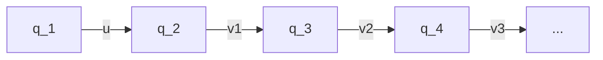

# 1 Impementing another Automaton having [[Justice]]

## 1.1 Two initial states

We want to create an Automaton that implements [[Justice]].
$A=\{a_1,a_2,....,a_i,...,a_k\}$

We require [[Justice]] for the transition $a_i$.

If there is an ingoing edge labeled by $a_i$ it means that it was $TAKEN$:
-- $a_i$ --> (s)

Viceversa if we have an outgoing label by $a_i$ this means $ENABLED$ in the current state.
(s) -- $a_i$ -->

![[Verification 22_image_1.jpeg]]

$$A_1,A_2,...A_8 \subseteq A-\{a_i\}$$
It is a [[Non deterministic]] automaton. Therefore we can reach multiple states with one read in symbol.

 This means that $A_1,A_2,...,A_8$ are not disjoint. I.e. they could share elements.

Remark: We can safely assume that all $A_j$ are equal to $A-\{a_i\}$ 

We can see that when we build a product automaton, we can achieve that $s$ is only taking care of the transition system and $s'$ is only taking care of justice. If one of the two states has a word that is not enabled it means the machine can not move to the state that is blocked. 

![[Verification 22_image_2.jpeg]]

- $s$ [[Buechi automata|Buechi-automaton]] for the transition system
- $s'$: [[Buechi automata|Buechi-automaton]] for justice
- $a_j[s]$: state that is reached from $s$ when $a_j$  is read in.

## 1.2 One initial state
We add a initial states before the initial states from [[Verification 22_image_1.jpeg]].

==Rule:== One has to be able to go in one step from the new initial state $q_0$ to all states that were reachable with one hop from the old initial states. 

One uses $q_0$ only at the beginning, then it is never entered again.

![[Verification 22_image_3.jpeg]]

> [!note] [[Theorem 11]]
> We can always rewrite a [[Buechi automata]] to have a unique initial state without entering transition.

 
Another example:

![[Verification 22_image_4.jpeg]]

---
break

---

# 2 Closure under [[Complementation]] of the [[Buechi automata]]

Why is it important?
We can reduce the [[Model-checking]] problem to the [[emptyness problem]].

> [!note] Definition: [[Congruence]]
> An [[Equivalence Relation]] $\sim$ over a set $A$ is a [[Congruence]] (to respect to the concatenation operation) if for all $x,x',y,y' \in A$ it holds that $x \sim y$ (x and y are in the same [[Equivalence Relation]]) and $x' \sim y'$, then $x \cdot x' \sim y \cdot y'$

==Example:==
Let us consider the set $A^*$ we say that two finite words $u,v \in A^*$  belong to the same [[Equivalence class]] i.e. ($u \sim v$)  when they have the same [[parity]]. 

Note: [[parity]] means either they have both an even number of symbols or both an uneven number of symbols

ex: 
$parity(aba)=3$
$parity(ccbaa)=5$
$aba \sim ccbaa$

other example
$aa \not \sim aaa$ 

Question is it a [[Equivalence Relation]]

is it [[finite index]]? ==yes== two classes
Is it a [[Congruence]]? Yes as:

$even \cdot even = even$
$even \cdot odd = odd$
$odd \cdot even = odd$
$odd \cdot odd = even$

> [!note] [[Saturation]]
> A [[Congruence]] $\sim$ [[Saturation|saturate]]s an [[w-regular|w-language]] $L  \subseteq A^\omega$  if for all pairs $u,v$ which are [[Equivalence class]]es, $u \cdot v^w \cap L \not = \emptyset$, then all $u \cdot v^w \subseteq L$ or as one could say $u \cdot v^w \cap L = u \cdot v^w$. 

reminder: $\cap$ is the $and$ of sets

==Visually:==
![[Verification 22_image_5.jpeg]]

==Examples== for [[Congruence]]s that behave this way:

> [!note] [[Theorem 12]]
> Let $\sim$ be a [[Congruence]] and $L \subseteq A^w$ be a [[w-regular|w-language]]. If $\sim$ saturates $L$, then $\sim$ also saturates $\overline{L}$.

 ==Proof by contradiction:==
Let us assume that $\sim$ does not saturate $\overline{L}$. This implies there exists two [[Equivalence class]]es $u,v$ such that $u \cdot v^w \cap \overline{L} \not  = \emptyset$ but there is an element that is not part of $\overline{L}$ i.e. $u \cdot v^w \not \subseteq \overline{L}$. By $u \cdot v^w \not \subseteq \overline{L}$ it follows that there exists a [[omega-words|w-word]] $\alpha$ such that exists $\alpha \in u \cdot v^w$ and $\alpha \in L$. Since $\sim$ [[Saturation|saturate]]s $L$,  if one word $\alpha$ is in $L$ all words need to be in L. Therefore from $\alpha \in u \cdot v^w \cap L$ , it follows that $u \cdot v^w \subseteq L$ is a contradiction

Let $\mathcal{A}=\{Q,A,\Delta, q_0,F\}$,  a word $w \in A^*$ and two states $s,s' \in Q$. $s$ is the initial state $s'$ is the final state.

==Lets introduce a new syntax:==

- $s \rightarrow_w^F s'$

We write $s \rightarrow_w^F s'$   if there exists a [[P-Computation]] of $\mathcal{A}$ on $w$ from state $s$ to state $s'$ where at least one state of the computation, including $s$ and $s'$ is a final state.

==Visually==

![[Verification 22_image_6.jpeg|400]]

Now if we want to find all words $w$ creatable from an alphabet $A$ that fulfill this property we write it like this:
$$w_{ss'}^F=\{w\in A^*: \quad s \rightarrow_w^F s'\}$$
Reminder: $w_{ss'}^F$ is regular.

## 2.1 The $\approx_{A}$ relation

> [!note] Definition $\approx_A$
> Let $\mathcal{A}=\{Q,A,\Delta, q_0,F\}$  be a [[Buechi automata]], we define a relation $\approx_A$ on $A^*$ such that $u \approx_A v$ if for all $s,s' \in Q$ the following holds: $s \rightarrow_u s'$ if and only if $s \rightarrow_v s'$ and $s' \rightarrow_u^F s' \iff s \rightarrow_v^F s'$ 

Description: If I can go from $s$ to $s'$ using $u$ I also need to be able to go from $s$ to $s'$ using $v$. Furthermore if we go through a final state reading the word $u$ I also must go through a final state when reading $v$.

> [!note] [[Lemma 12]]
> Let $\mathcal{A}$ be a [[Buechi automata]]. The relation $\approx_A$ is a [[Congruence]] of [[finite index]] that [[Saturation|saturate]]s $L(A)$

==prove of [[Congruence]] and [[finite index]] by me of [[Lemma 12]]==

![[Verification 22_image_7.jpeg]]

Prove$\approx_A$ [[Saturation|saturates]] $L(A)$ and thus $\overline{L(A)}$
Let $\mathcal{A}=\{Q,A,\Delta, q_0,F\}$  and $u,v$ be classes of $\approx_A$. Now let us consider a word $\alpha \in u \cdot v^w \cap L(A)$. Now as it is a member all words creatable using $u$ and $v$ need to be part of the Language $L(A)$.

From $\alpha \in L(A)$ there exists a successful [[P-Computation]] of the [[Deterministic Finite State Automata|Automaton]] on $\alpha$.

From $\alpha \in u \cdot v^w$ it follows that there exists a $u \in U$ and $v_1,v_2,v_3... \in V$ such that $\alpha =  u \cdot v_1 \cdot v_2 \cdot v3\cdot ...$ 

Putting the two statements together we get:

Since the computation is successful for infinitely many pieces we pass through a final state, now we have to remember the definition of $\approx_A$ they are in the same class when they behave in the same way towards two states, as well as the condition of passing through a final state.

As there is a successful computation we pass through at least a final state infinitely many times i.e. $q_i \rightarrow_{v_i}^{F}q_{i+1}$.

==Reminder:== We want to show that if $u \cdot v^w \cap L(A) \not = \emptyset \implies u \cdot v^w \subseteq L(A)$ 

Now let $\beta = u'v'_1v'_2v'_3 \in u \cdot v^w$ we show that $\beta \in L(\mathcal{A})$, since $u \approx_A u'$ and $v_i \approx_A v_j'$ for all $j$, it holds that $q_0 \rightarrow_{u'}q_1 \rightarrow_{v_1'} q_2 \rightarrow_{v_2'}...$  and for infinitely many values of the index $j$ it holds that $q_j\rightarrow_{v_j'}^F q_{j+1}$ .

This is enough to conclude that $\beta \in L(A)$ .

> [!note] [[Corollary 5]]
> Given a [[Buechi automata|Buechi-automaton]] $\mathcal{A}$. $\approx_A$ is a congruence that saturates $\overline{L}$.

### 2.1.1 Remark: by [Myhill-Nerode Theorem](Theorem%206.md)

Each class of $\approx_A$ is [[Regular Languages|Regular]].

> [!note] [[Lemma 13]]
> Let $\sim$ which is a [[Congruence]] of finite index on $A^*$. For all [[omega-words|w-words]] $\alpha \in A^w$ there exist two classes $u,v$ of $\sim$ such that $\alpha \in u \cdot v^w$ with $v \cdot v \subseteq V$.

However I take a [[omega-words|w-word]] I am able to decompose it into a finite prefix $u$ and a infinite sequence of [[Word]]s belonging to $V$.  I.e. there is always a [[Equivalence]] that can split any [[omega-words|w-word]] in two classes. One class for $u$ and one class for the repeating part $v$.

![[Verification 22_image_8.jpeg|400]]

> [!note] [[Corollary 6]]
> Let $L \subseteq A^w$ be a [[w-regular|w-language]] and $\sim$ be a [[Congruence]] of [[finite index]] that [[Saturation|saturate]]s $L$.
> 
> It holds that the [[Language]] $L$ can be expressed as: $L = \cup \quad u \cdot v^w$
> 
> Where $u,v$ are [[Equivalence class]]es such that $u \cdot v^w \cap L \not = \emptyset$

==Proof:==
We proof with two inclusions $\subseteq$. This is the equivalent of proving $=$ i.e equality once.

1. inclusion $L \subseteq \cup u \cdot v^w$
	Follows from [[Lemma 13]] 
2. inclusion $\cup u \cdot v^w \subseteq L$
	follows from the fact that $\sim$ [[Saturation|saturate]]s L

> [!note] [[Theorem 13]]
> If $L \subseteq A^w$ is [[w-regular]], then $\overline{L}(= A^w-L)$ is [[w-regular]] as well. Moreover from a [[Buechi automata|Buechi-automaton]] for $L$ we can build a [[Buechi automata|Buechi-automaton]] for $\overline{L}$

---
==break 23 a==

---

==proof [[Theorem 13]]==

Let $\mathcal{A}$ be a [[Buechi automata|Buechi-automaton]] such that $L(\mathcal{A})=L$.

What do we already know?
1. $\approx_a$ is a [[Congruence]] of [[finite index]] that [[Saturation|saturate]]s $L$ and $\overline{L}$.

By [[Corollary 6]] it follows that:
$$\overline{L} = \cup u \cdot v^w$$
where $u,v$  are $\approx_A$ classes such that $u \cdot v^w \cap \overline{L} \not = \emptyset$
Since $u,v$ are regular languages i.e. we can build [[Finite State Automata]] for both of them, and [[w-regular]] languages are closed under [[w-closure]], [[Concatenation]] and [[Union]] we can conclude that $\overline{L}$ is [[w-regular]].

What does this mean:
1. We can not leave [[w-regular]] languages when applying the union $\cup$
2. We can not leave [[w-regular]] languages when applying concatenation ($u \cdot v$)
3. We can not leave [[w-regular]] languages when applying the $w$ operator i.e. $v^w$

As we can create $\overline{L}$ using this operators and [[Finite State Automata]] we can be sure that also $\overline{L}$ is a [[w-regular]].

Let us show now that the construction of the [[Buechi automata]] for $\overline{L}$ is effective (we can actually build it).

First we notice that $u \cdot v^w \cap \overline{L} \not = \emptyset \iff u \cdot v^w \cap L = \emptyset$  (by definition of [[Saturation]]) and the test for emptiness is [[decideability|decidable]].

Since the [[Union]] is finite ($\overline{L} = \cup u \cdot v^w$)  and the construction of the [[Buechi automata]] for the [[Union]] is effective, these concludes the proof.

> [!note] [[Theorem 14]]
> Given the [[Buechi automata|Buechi-automaton]] $\mathcal{A}$ and $\mathcal{A}'$ are decidable
> 
> 1. $L(\mathcal{A}) = A^w$ ([[Universality problem]])
> 2. $L(\mathcal{A}) \subseteq L(\mathcal{A}')$ ([[Model-checking]])
> 3. $L(\mathcal{A})=L(\mathcal{A}')$ ([[Equivalence problem]])

We can reduce each of the three problems to the [[emptyness problem]].
For instance:
 $L(\mathcal{A}) \subseteq L(\mathcal{A}') \equiv L(\mathcal{A}) \cap L(\mathcal{A}') = \emptyset$
 

## 2.2 Consequences of ==closure under complementation==
A Consequence of [Closure Property| closure](Theorem%205.md) under [Complementation](Complementation.md) (what we just proved) of [[Buechi automata]] is that [[w-regular|w-regular-language]]s are univocally (only having one possible meaning, unambiguous) characterized by their set of [[ultimately periodic w-word]]s.

Notation:
 $UP(L)$: The set of [[ultimately periodic w-word]]s in $L$

Let $L_1,L_s$ be two [[w-regular]] languages:
$$UP(L_1) = UP(L_2) \iff L_1 = L_2$$
The [[ultimately periodic w-word]]s are the fingerprints of the language.

==Proof by contradiction==

By Contradiction let $UP(L_1)=UP(L_2)$ and $L_1 \not = L_2$.

Without the loss of generality, let us assume that $L=L_1-L_2 \not = \emptyset$ .

![[VV23_1.jpeg]]

The ==Without the loss of generality==  means that If  $L=L_1-L_2 \not = \emptyset$   does not hold we just exchange the  roles of $L_1$ and $L_2$.

Since $L$ is not empty and [[w-regular|w-regular-language]]s are closed under [[Complementation]] and [[Union]] ($L_1-L_2 \equiv L_1 \cap \overline{L_2}$)  it follows that $L$ is a [[w-regular|w-regular-language]]. Additionally we now that it includes at least one [[ultimately periodic w-word]] ([[Corollary 4]]).

But we started from the assumption that $UP(L_1)=UP(L_2)$ meaning that $L$ should not have any [[ultimately periodic w-word]] . ==This is a contradiction!==

[[ultimately periodic w-word]] have two roles:

1. Check for emptiness, we restrict our search for a [[ultimately periodic w-word]] (witness), we look for a cycle in the automaton with a final state.
2. A characterization of a [[w-regular|w-regular-language]] (fingerprinting)

# 3 Using [[Deterministic Finite State Automata|Automata]] to describe logical formulas

[[Buechi automata]] and [[Sequence Calculus]] we will investigate the relationship between [[Buechi automata]] and the [[Monadic second order of one sucessor]]. The main result is the equivalence of [[w-regular|w-regularity]] and [[Monadic second order of one sucessor|S1S]] definability. Meaning that all [[Buechi automata]] can also be defined by a [[Monadic second order of one sucessor|S1S]] problem. ([[Verification 24]])

