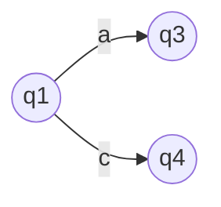

This class will be about giving examples to the theorems and proofs that were proved last class in [[Verification 8]]. i.e. [[Theorem 1]].

# [[Hintikka Formula]]s

The [[Hintikka Formula]] $\phi^n_S$ is parametrized by the number of rounds one has to survive the game and $S$ the structure over which we want to prove the [[n-equivalence|n-equivalence]].

We showed the [[Hintikka Formula]] in a recursive manner with the base case i.e. n=0 meaning no quantifiers are allowed:

base case n=0: $$\phi_S^{n=0}= \bigwedge\limits_{\substack{\alpha\text{ are atoms}\\\text{over appr. signature}\\S \models \alpha }} \alpha \lor \bigwedge\limits_{\substack{\alpha \text{ are atoms}\\S \not\models \alpha}}\neg \alpha$$ 

## Example:
Definintion structure:
$S =(\underbrace{{1,2,3,4}}_{\text{Universe }U^S},\underbrace{<}_{ordering},\underbrace{A}_{\{0\}},\underbrace{B}_{\{1,2,3\}}$ 

<,A,B are relationship symbols
 
 This is a respresentation of a finite string containing the two letters A and B.
 S in particular is the string "a,b,b,b" as A = {0} i.e. a is at the zeroth postion and the rest of the string are b's because of B ={1,2,3}
 
 ==Question:== What is the [[Hintikka Formula]] for this structure?
 Lets start with the [[Hintikka Formula]] level 0 i.e. $\phi_S^0$
 This Structure does not allow any interpretation of free variables therefore we are not allowed to use <,A,B as they are requiring variables.
 Therefore we are not able to write anything besides:
 true: the atom that does not use any variables
 false: the negated atom that are not true in S 
 
 i.e. : $\phi_S^0=\text{true} \lor \neg \text{false}$
Now the  [[Hintikka Formula]] level 1 i.e. $\phi_S^1$:

But lets first go more general how is the [[Hintikka Formula]] on level n defined:
$$\phi_S^n = \bigwedge\limits_{u \in U^S} \exists x \phi_{S[x=u]}^{n-1} \lor \forall x \bigvee\limits_{u \in U^S} \phi_{S[x=u]}^{n-1} $$
 
$u \in U^S$: all objects of my universe

What is  $\phi_{S[x=0]}^0$? 
$\phi_{S[x=0]}^0 = \text{true} \land (x=x) \land A(x) \land \neg   \text{false} \land \neg(x<x) \land \neg B(x)$

This are all formulas that are possible with the  interpretation of $x=0$ 

How does it look when we have $x=1$?
$\phi_{S[x=1]}^0 = \text{true} \land (x=x) \land B(x) \land \neg   \text{false} \land \neg(x<x) \land \neg A(x)$

==note:== $A(x)$ turns to $B(x)$ in $x=1$ as the second position of $'abbb'$ is b instead of a where $x=0$

==Question:== how does the [[Hintikka Formula]] for $x=2$ look like? Answer it looks the same as $x=1$ and $x=3$ because the positions from 1 till 3 are all $b$ ($'abbb'$)

So summarizing how does the [[Hintikka Formula]] look like?
$$\phi^0_S=\exists x \phi_{S[x=0]}^0 \land \exists x \phi_{S[x=1]}^0 \land \exists x \phi_{S[x=2]}^0 \land \exists x \phi_{S[x=3]}^0$$

Now that we have all [[Hintikka Formula]]s for each element of our universe we go the next step creating the [[Hintikka Formula]] on quantifier level 1 i.e. $\phi_{S[x=1]}^1$.
---
$$\phi_S^1=(\exists x \phi_{S[x=0]}^0) \land (\exists x \phi^0_{S[x=1]})... \land ... \land \forall x (\phi_{S[x=0]}^0 \lor \phi^0_{S[x=1]}... \lor ... )$$

When writing the statement out what does the [[Hintikka Formula]] mean?
There is x labeled $a$ ($A(x)=true$), there is $x$ labeled by b ($B(x)=true$), and for every $x$, $x$ is either labeled by $a$ or by $b$ ($\forall x A(x) \lor B(x)$) 

```ad-note 
take $S' = (\{0,1\},<,\underbrace{A}_{\{1\}},\underbrace{B}_{\{0\}})$="ba". 
This structure is actually different from the structure before but when the [[Hintikka Formula]]s of level one of $S$ and $S'$ are logically equivalent i.e. $\phi_S^1 \equiv \phi_{S'}^1$. Note: syntactically the formulas are not the same but they are still [[logical equivalence|logically equivalent]]
```

Now lets look at all [[Hintikka Formula]]s of string structures with 'a' and 'b'. i.e.

$string\_structures=\{\epsilon,'a','b','aa','bb','ab','ba....\}$

We know that 'ba' and 'abbb' have the same [[Hintikka Formula]]. Might it be that we can put the strings into classes where all strings have the same [[Hintikka Formula]]? ==Yes we can.==

1. All strings where one position is labeled by 'a' and one position labeled by 'b' e.g. 'abbb'
2. all positions are only labeled 'a'
3. all positions are only labeled 'b'
4. $\epsilon$ i.e. empty string

There is only a limited number of partitions possible when having a low level of the [[Hintikka Formula]] the higher the level the more classes can we create.

---
Lets now look at the [[Hintikka Formula]] n=2...
$$S='abbb'$$
The definintion of the [[Hintikka Formula]] n=2 is:
$$\phi_S^2= \bigwedge\limits_{u \in U^S} \exists x \quad \phi_{S[x=u]}^1 \land \forall x \quad \bigvee\limits_{u \in U^S}\phi_{S[x=u]}^1$$ 

We note that $\phi_{S}^1$ which is the [[Hintikka Formula]] of level 1 is different from $\phi_{S[x=u]}^1$ as it is an expanded structure i.e. our variables are assigned a value from the universe $U$.

Lets look what the individual $\phi_{S[x=u]}^1$  are?

- $\phi_{S[x=0]}^1$
	> $\phi_{S[x=0]}^1= \bigwedge\limits_{v\in U^S} \exists y \phi_{S[x=0][y=v]}^0 \quad \land \quad \forall y \bigvee\limits_{v\in U^S}\phi_{S[x=0][y=v]}^0$
	> How does it look when $[y=2]$
	> $$\phi_{S[x=0][y=2]}^0=\text{true} \land (x=x) \land (y=y) \land (x<y) \land A(x)\land B(y)\land...$$ $$...\land \neg\text{false} \land \neg (x<x) \land \neg(y<y) \land \neg A(y)\land \neg B(x)$$ 
	> What are the important things in this formula stating something about the structure? Its this three things: $A(x),B(y)$ and $(x<y)$ the rest is obvious.
	> How does it look when $\phi_{S[x=0][y=0]}^0$
	> $$\phi_{S[x=0][y=0]}^0=\text{true} \land (x=x) \land (y=y) \land (x=y) \land A(x)\land A(y)\land...$$ $$...\land \neg\text{false} \land \neg (x<x) \land \neg(y<y) \land \neg(y<x) \land \neg B(x)\land \neg B(y)$$

How does the complete formula look like?
$$\phi_S^2=(\exists x \exists y (x<y) \land A(x) \land B(y) \land...)\land$$
$$..\land(\exists x \exists y (x<y) \land B(x) \land A(y) \land...)\land...$$

Now that we can assume how the higher order [[Hintikka Formula]]s look like lets look again at the individual classes of [[Hintikka Formula]]s.
Are the [[Hintikka Formula]]s for $S=\text{'abbb'}$ and $S=\text{'abbbbb'}$ [[logical equivalence|logically eqivalent]]? Yes they are.
How about  $S=\text{'abbb'}$? They are different as we are missing the part of the [[Hintikka Formula]] where both elements are 'b' i.e $\phi_S^2= ...\exists x \exists y \quad (x<y) \land B(x) \land B(y)...$

The higher the level is the more different strings can we distinguish in the [[Hintikka Formula]]s.

While on order 0 we could only we only had three classes $\{\epsilon,a,b\}$ at order one we could already distinguish more classes i.e. $\{	

==Lets Recall:==
Property $P$ containing is not definable in [[FO]] if for all $n$ $\exists S,S'$ while $S,S'$ are [[n-equivalence|n-equivalent]] while $S \in P$ and $S \notin P$. [[Lemma 10]].

We can rewrite the property $S,S'$ are n-equivalent by saying their [[Hintikka Formula]] are [[logical equivalence|logically equivalent]] i.e $\phi_S^n \equiv \phi_{S'}^n$

A third way to describe $S,S'$ are n-equivalent is by stating [[Theorem 1]] $S$ and $S'$ are [[n-equivalence|n-equivalent]] when the  Duplicator survives n-rounds in the [[Ehrenfeucht-Fraise game]] $G_{S,S'}$
---
Break
---
# Automata theory
==Book for reference==: Automata theory, Languages and computation 3rd edition Hopcroft, motwani, Udine

# Finite State automata (over finite words) and regular expressions

We have:
[[Symbols]]: e.g.    a,b,c... or 0,1,2...
[[Words]]: e.g. abbca
variables used for words are $w,u,v$ e.g. $u = abbca$
length of a word: e.g $|a|$= number of [[Symbols]] of word
e.g. $u = abbca$ i.e. $|u|=5$

A special word $\epsilon$ is the empty word $\epsilon=""$ and $|\epsilon|=0$

Basic operation [[Concatenation]] denoted by $(\cdot)$
given two words $u,w$ the concatenation of $u$ and $w$ is denoted by $u \cdot w$ ==important:== $u \cdot w \neq w \cdot u$.
Sometimes we can denote a concatenation as $uw= u \cdot w$

Sometimes we want to concatenate two sets of words $A$ and $B$ where the [[Concatenation]] is $A \cdot B = \{ u \cdot w: u \in A \land w \in B\}$

==special cases==
$w \cdot \epsilon = w$
$A \cdot \{\epsilon\} = A$
but
$A \cdot \{\emptyset\} = \emptyset$
The difference is that $\epsilon$ is an empty word $\emptyset$ is an empty set

==iterative concatination==
For all $n\geq 0$ we define, $A^n= A \cdot A \cdot ...$ for $n$ times.
Notable mentions:
$$A^0=\{\epsilon\}$$
$$A^{n+1}=A \cdot A^n$$


## [[Kleene-closure]]
[[Kleene-closure]] of a set $A$ denoted by $A^*$, is defined as:
$$A^*=\bigcup\limits_{u\geq0} A^n= \{\epsilon\}\cup A \cup A \cdot A\cup A\cdot A\cdot A \cup...$$
i.e. all finite words that can be obtained by [[Concatenation]] of $A$ with itself.
In all important cases the result of a [[Kleene-closure]] is a infinite set but consist of finite words.

Example:
$A=\{a\}$ 
$A^*=\{\epsilon\} \cup \{a\} \cup \{aa\}...$

==What is $A^+$==
$A^+=A^*-\{\epsilon\}$
Example:
$A=\{a\}$ 
$A^+=\{a\} \cup \{aa\}...$

## What is a [[Language]]?
Given an [[Alphabet]] $A$ (Finite set of [[Symbols]]) a [[Word]] over A is just an element of $A^*$

A [[Language]] $L$ over $A is a subset of $A^* (L \leq A^*)$  i.e. a language is a subset of words of $A^*$


# Automata
Automata stands for [[Deterministic Finite State Automata]]
```ad-note
title: Definintion: [[Deterministic Finite State Automata]]
A [[DFA]] \mathcal{A} is a tuple $(Q,A,\delta,q_0,F)$ where
- $Q$ is a finite set of states
- $A$ is a finite set of Symbols i.e. [[Alphabet]]
- $\delta$ is a [[Transition function]]  $\delta: Q \times A \rightarrow Q$
- $q_0$ is the initial state and is $q_0 \in Q$ 
- $F$ is a subset of $Q$ i.e $F \subseteq Q$ containing all final states
```

==1830==
How do we paint a [[Deterministic Finite State Automata|Automata]]?
example graph:

 What means ==Deterministic==?
 Deterministic means that if you have a state $s1$ and [[Symbols|Symbol]] a. Then you can only reach one other state $s2$ when the [[Deterministic Finite State Automata|Automata]] is in state $s1$ and gets the input $a$.
 
 We can generalize $\delta$ the transition function from [[Symbols|Symbol]]s to [[Word]]s 
 We have:
 $$\hat{\delta}: Q \times A^* \rightarrow Q$$ is defined as follows:
 
 What happens if we [[Concatenation|concatenate]] the empty word $\epsilon$ to $q$?
 - $\hat{\delta}(q,\epsilon)=q$
 
 How does the state change if we apply a word  and then concatenate a symbol a to the start?e.g. $wa$ 
 - $\hat{\delta}(q,wa) = \hat{\delta}(\delta(q,w),a)$

[[Acceptance condition]]: Defines how a word $w$ needs to be formed so that  a [[Deterministic Finite State Automata|Automata]] $\mathcal{A}$ (starting from a initial state $q_0$) after processing ends in a state which is part of the set of final states $F$. 
i.e $\hat{\delta}(q_0,w) \in F$

The language $L(\mathcal{A})$ accepted by $\mathcal{A}$ consists of all and only those words in $A*$ which are accepted by the [[Deterministic Finite State Automata|Automata]] (as of the definition of the [[Acceptance condition]]) that means the language will be a subset of $A*$ i.e. $L(\mathcal{A}) \subseteq A^*$

##  [[Regular Languages]]
A language $L \subseteq A^*$ is ==Regular== if it is accepted by a [[Deterministic Finite State Automata|DFA]] $\mathcal{A}$ that is $L=L(\mathcal{A})$

The difference between $\delta$ and $\hat{\delta}$ is that one only has symbols ($\delta$)as inputs the other has words ($\hat{\delta}$) as inputs. From now on we will use $\delta$ for both automata with words and [[Deterministic Finite State Automata|Automata]] that have symbols as input indiscriminantely.

# [[Non Deterministic Finite State Atomata]] ([[Non Deterministic Finite State Atomata|NFA]])
Definition:
An [[NFA]] $\mathcal{A}$ is  a tuple ($Q,A,\delta,q_0,F$) where $Q,A,q_0$ and $F$ are defined as in [[Deterministic Finite State Automata|DFA]] except for the transition function $\delta$ where:
$$\delta: Q \times A \rightarrow 2^Q$$
That means that from one state $q$ one can reach more than one state when it gets a symbol as input. Depending on a random variable for example)

Notationally a $\delta$ of a [[Non Deterministic Finite State Atomata|NFA]] can be also defined as $\delta \subseteq Q \times A \times Q$ We denote a the transition function of a [[Non Deterministic Finite State Atomata|NFA]] as capital delta i.e. $\Delta$.

==Summary==
- When we use $\delta$ we are in the Deterministic world
- When we use $\Delta$ we are in the non-Deterministic world.

As before we generalize $\delta$ from symbols to words.
One problem that we face is that after applying one word the state can differ i.e. the state when we apply the second symbol might be multiple symbols. Therfore we express the current state now as a set of possible states.

$\hat{\delta}=\{q\}$
For all words $w$ and all symbols $a$
$\hat{\delta}(q,wa) = \bigcup\limits_{p \in \hat{\delta(q,w)}} \delta(p,a)$]

This means that we need to create a set out of all possible outcomes of the [[Non Deterministic Finite State Atomata|NFA]] when applying the word w to it. Then we apply to each state of the machine in this set the input $a$ to get our resulting set of states. 

## The Non-Deterministic [[Acceptance condition]] 
A word $w$ is accepted by a [[Non Deterministic Finite State Atomata|NFA]] $\mathcal{A}$ if (and only if) $\hat{\delta}(q_0,w) \bigcap F \neq \emptyset$. 

This means that when a word is applied to an [[Deterministic Finite State Automata|Automata]] there needs to be a chance for it to finish in a state which is part of the final states. i.e. one of the states in the set of all states that the [[Deterministic Finite State Automata|Automata]] can be in after applying a word needs to be in the set of final states $F$.

The Language  $L$ accepted by an [[Non Deterministic Finite State Atomata|NFA]] $\mathcal{A}$ consists of all words (and only those) [[Word]]s over the alphabet $A$ accepted by $\mathcal{A}$.

As before we will use $\delta$ for $\hat{\delta}$ indiscriminantely.

[[Theorem 2]]:
For all [[Non Deterministic Finite State Atomata|NFA]] $\mathcal{A}$ there exists a [[Deterministic Finite State Automata|DFA]] $\mathcal{A}'$ such that $L(A)=L(A')$ and vice versa.

Proof: [[Non Deterministic Finite State Atomata|NFA]] $\leftarrow$ [[Deterministic Finite State Automata|DFA]] is trivial as a [[Deterministic Finite State Automata|DFA]] is a [[Non Deterministic Finite State Atomata|NFA]] with all probabilities being 1.
[[Non Deterministic Finite State Atomata|NFA]] $\rightarrow$ [[Deterministic Finite State Automata|DFA]] 
Can be proved by the subset construction and is proven in [[Verification 10]]

==generalization== Delta can be in a set of states not only in one state like in [[Deterministic Finite State Automata|DFA]]
$\delta: 2^Q \times A^* \rightarrow 2^Q$
$\delta(\underbrace{\underline{P}}_{\text{set of states}},w)= \bigcup\limits_{p \in \underline{P}} \delta(p.w)$

